# 一、数学基础

## 1.经典视觉SLAM框架

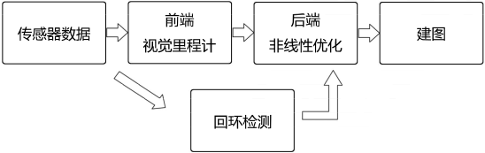

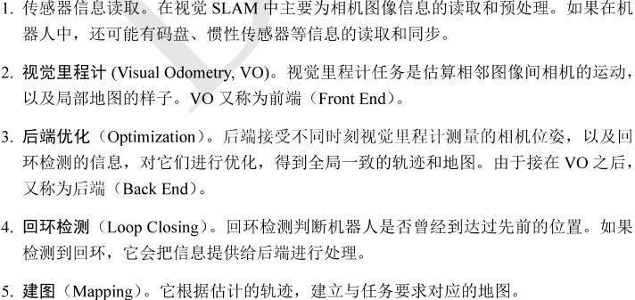

## 2.三维空间刚体运动

### 2.1旋转矩阵

#### 向量表示

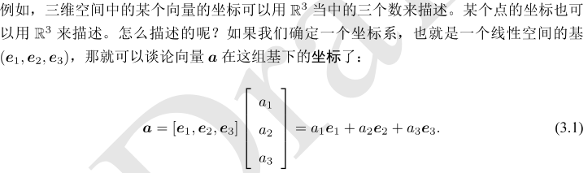

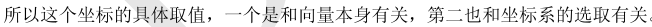

#### 内积

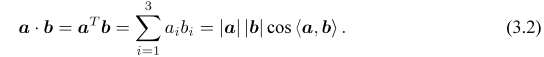

#### 外积

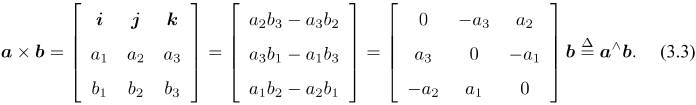

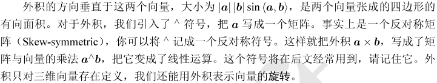

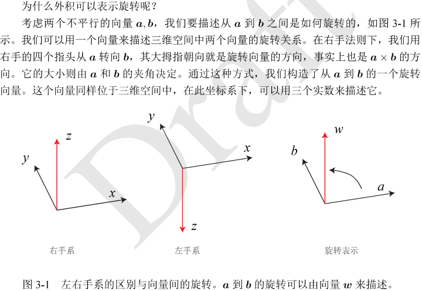

#### 坐标系间的欧式变换

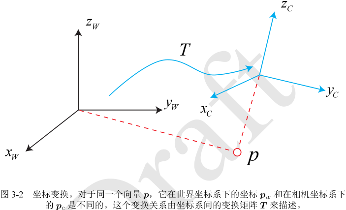

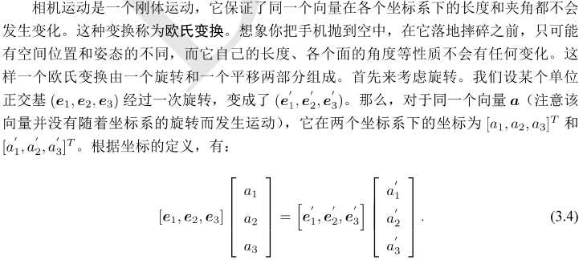

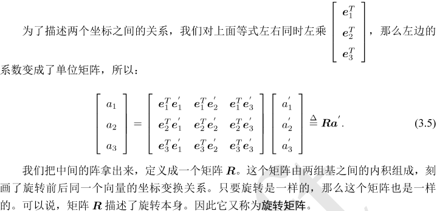

#### 旋转矩阵

它是一个行列式为1的正交矩阵，正交矩阵即逆为自身转置的矩阵。反之，行列式为1的正交矩阵也是一个旋转矩阵。因此，旋转矩阵的集合定义如下：

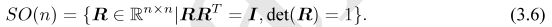

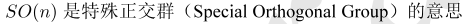

通过旋转矩阵，我们可以直接讨论两个坐标系之间的旋转变换，换句话说，旋转矩阵可以描述相机的旋转。

由于旋转矩阵为正交阵，它的逆(即转置)描述了一个相反的旋转，有：

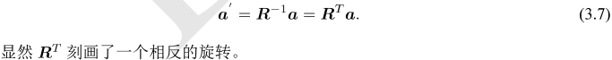

把旋转和平移合到一起，有：

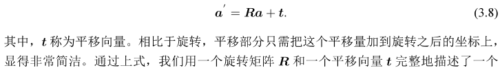

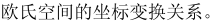

#### 变换矩阵与齐次坐标

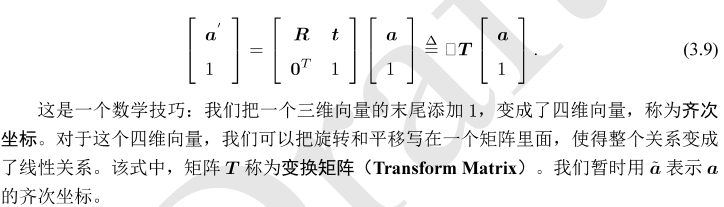

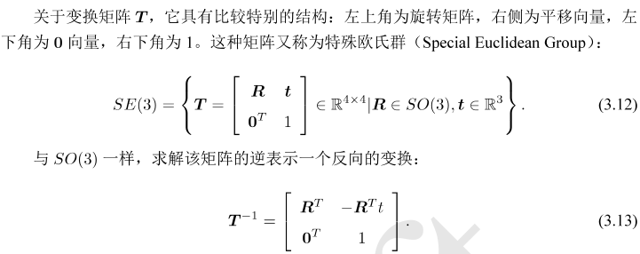

#### 矩阵Cholesky分解及求解线性方程组

https://blog.csdn.net/xbinworld/article/details/104663481

### 2.2旋转向量和欧拉角

#### 旋转向量

任意旋转都可以用一个旋转轴和一个旋转角来刻画。我们可以使用一个向量，其方向与旋转轴一致，而长度等于旋转角，这种向量，称为旋转向量(或轴角，Axis-Angle)。

假设有一个旋转轴为n，角度为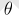，显示，它对应的旋转向量为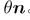。由旋转向量到旋转矩阵的过程由罗德里格斯公式(Rodrigues's Formula)表面，

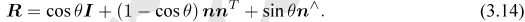

推导过程：https://blog.csdn.net/renhaofan/article/details/103706544

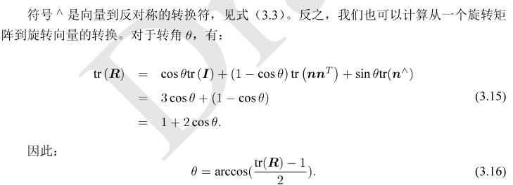

tr()是取迹

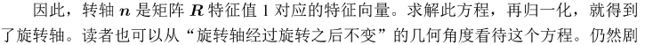

#### 欧拉角

定义一个刚体的前方为X轴，右侧为Y轴，上方为Z轴，则有：

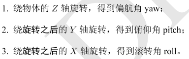

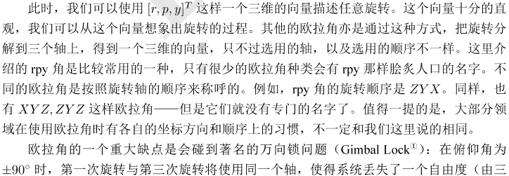

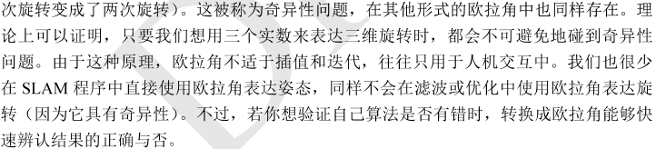

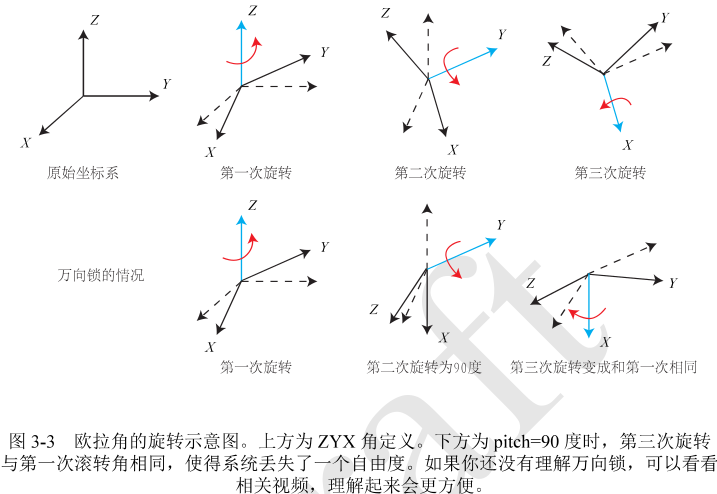

#### 四元数

四元数是Hamilton找到一种扩展的复数。它既是紧凑的，也没有奇异性。

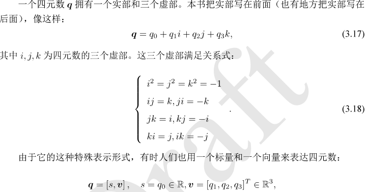

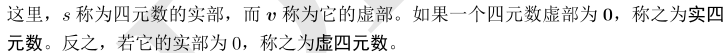

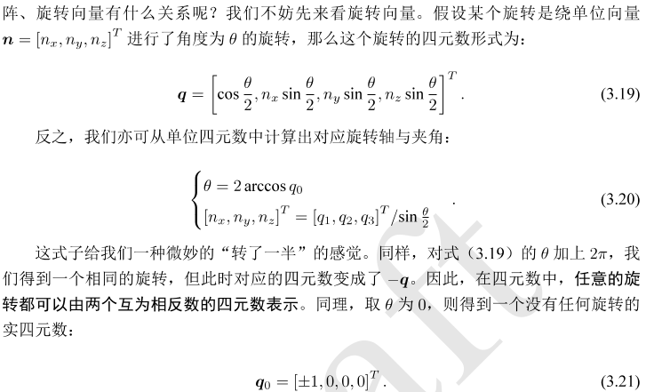

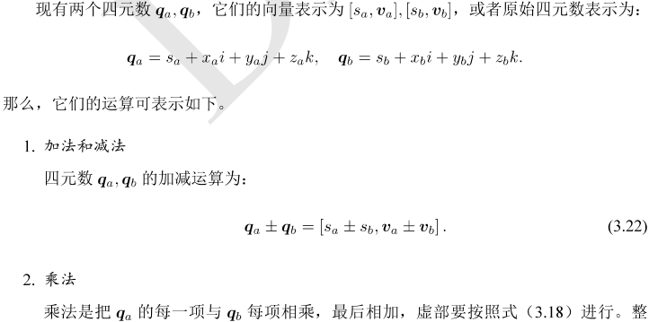

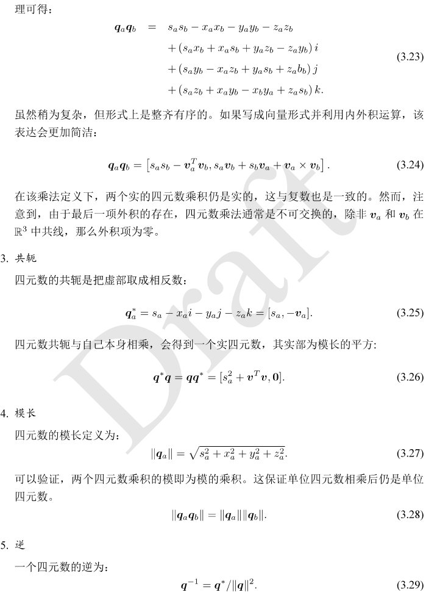

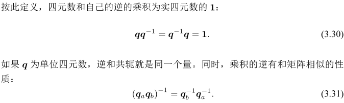

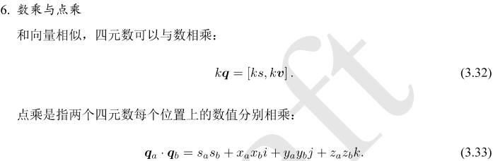

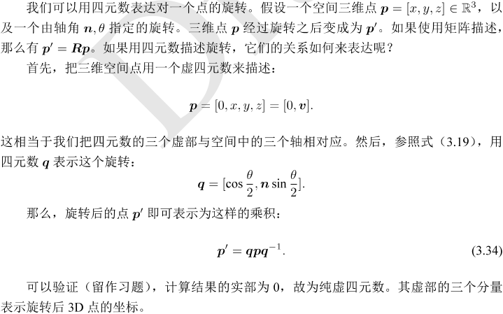

#### 四元数到旋转矩阵的转换

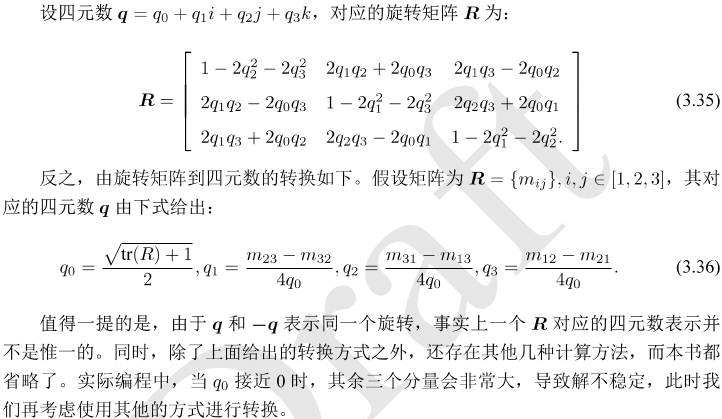

#### 相似、仿射、射影变换

欧式变换：保持了向量的长度和夹角，相当于我们把一个刚体原封不动地进行移动或旋转，不改变它自身的样子。

##### 1.相似变换

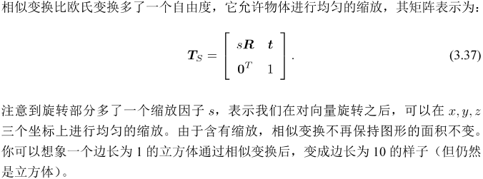

##### 2.仿射变换

##### 3.射影变换

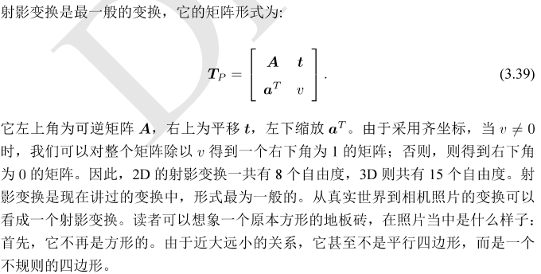

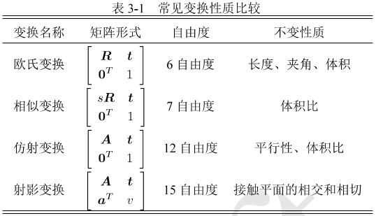

#### Eigen相关变量

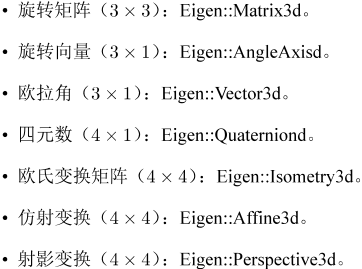

## 3.李群与李代数

#### 3.1李群李代数基础

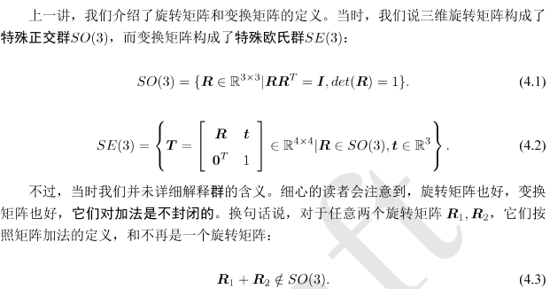

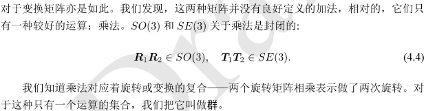

##### 3.1.1群

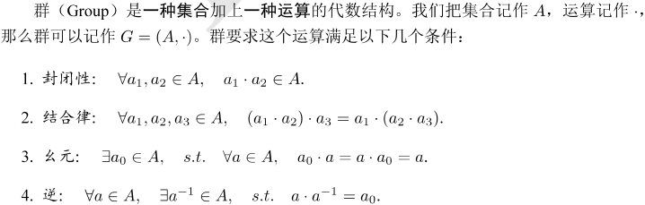

旋转矩阵集合和矩阵乘法构成群，变换矩阵和矩阵乘法也构成群。

矩阵中常见的群有：

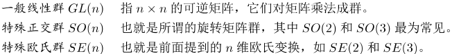

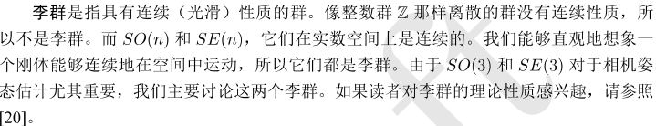

##### 3.1.2李代数的引出

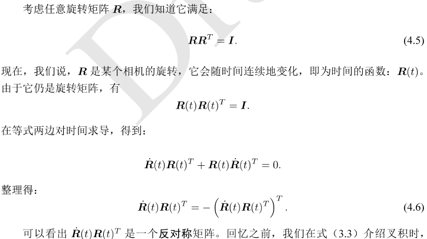

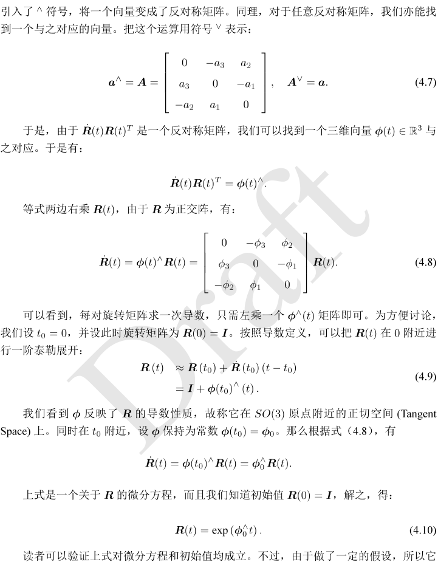

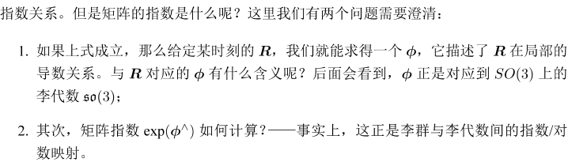

##### 3.1.3李代数的定义

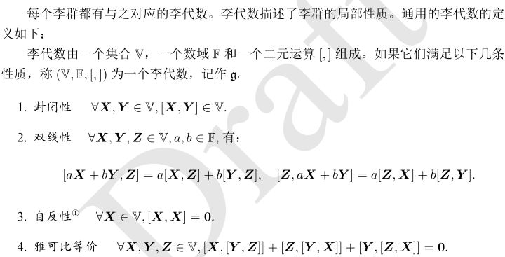

自反性是指自己与自己的运算为零。其中二次运算被称为李括号。三维向量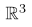上定义的叉积 x 是一种李括号，因此构成了一个李代数。

##### 3.1.4李代数so(3)

李代数是由一个三维向量组成的集合，每个向量对应到一个反对称矩阵，可以表达旋转矩阵的导数。

##### 3.1.5李代数se(3)

se(3)位于空间中：

#### 3.2指数与对数映射

##### 3.2.1 SO(3)上的指数映射

是一个矩阵的指数，在李群和李代数中，称为指数映射(Exponential Map)。

##### 3.2.2 SE(3)上的指数映射

#### 3.3 李代数求导与扰动模型

##### 3.3.1 BCH公式与近似形式

##### 3.3.2 SO(3)李代数上的求导

##### 3.3.3 李代数求导

##### 3.3.4 扰动模型(左乘)

##### 3.3.5 SE(3)上的李代数求导

#### 3.4 相似变换群与李代数

# 二、SLAM & SFM技术篇

## 4.相机与图像

### 4.1 相机模型

#### 4.1.1 针孔相机模型

#### 4.1.2 畸变

#### 4.1.3 双目相机模型

#### 4.1.4 RGB-D 相机模型

### 4.2 图像

## 5.非线性优化

### 5.1 状态估计问题

#### 5.1.1 最大后验与最大似然

#### 5.1.2 最小二乘的引出

### 5.2 非线性最小二乘

#### 5.2.1一阶和二阶梯度法

#### 5.2.2 Gauss-Newton

#### 5.2.3 Levenberg-Marquadt

### 5.3 Ceres

### 5.4 g2o

#### 5.4.1 图优化理论简介

#### 5.4.2 使用g2o拟合曲线

## 6.视觉里程计

### 6.1 特征点法

#### 6.1.1 特征点

#### 6.1.2 ORB特征

**FAST关键点**

**BRIEF描述子**

#### 6.13 特征匹配

### 6.2 计算相机运动

### 6.3 2D-2D: 对极几何

#### 6.3.1 对极约束

#### 6.3.2 本质矩阵

#### 6.3.3 单应矩阵

### 6.4 对极约束求解相机运动

**尺度不确定性**

**初始化的纯旋转问题**

**多于8对点的情况**

### 6.5 三角测量

### 6.6 实践: 三角测量

### 6.7 3D-2D: Pnp

#### 6.7.1 直接线性变换

#### 6.7.2 P3P

#### 6.7.3 最小化重投影误差求解 PnP

### 6.8 实践: 求解 PnP

### 6.9 3D-3D: ICP

#### 6.9.1 SVD方法

#### 6.9.2 非线性优化方法

### 6.10 实践：求解ICP

## 7.视觉里程计2

### 7.1 直接法的引出

### 7.2 2D光流

**Lucas-Kanande 光流**

### 7.3 实践： LK光流

**小结**

### 7.4 直接法

#### 7.4.1 直接法的推导

#### 7.4.2 直接法的讨论

### 7.5 实践： 直接法

**直接法优缺点总结**

## 8.后端1

### 8.1 概述

#### 8.1.1 状态估计的概率解释

#### 8.1.2 线性系统和KF

--------------------------------------------------------------------------------------------------------------------------------------

**A.3 复合的例子**

--------------------------------------------------------------------------------------------------------------------------------------

#### 8.1.3 非线性系统和EKF

#### 8.1.4 EKF的讨论

### 8.2 BA与图优化

#### 8.2.1 投影模型和BA代价函数

#### 8.2.2 BA的求解

#### 8.2.3 稀疏性和边缘化

#### 8.2.4 鲁棒核函数

**小结**

### 8.3 小结

## 9.后端2

### 9.1滑动窗口滤波和优化

#### 9.1.1 实际环境下的BA结构

#### 9.1.2 滑动窗口法

### 9.2 位姿图

#### 9.2.1 位姿图的意义

#### 9.2.2 位姿图的优化

### 小结

## 10.回环检测

### 10.1 概述

#### 10.1.1 回环检测的意义

#### 10.1.2 回环检测的方法

#### 10.1.3 准确率和召回率

### 10.2 词袋模型

### 10.3 字典

#### 10.3.1 字典的结构

### 10.4 相似度计算

#### 10.4.1 理论部分

### 10.5 实验分析与评述

#### 10.5.1 增加字典规模

#### 10.5.2 相似性评分的处理

#### 10.5.3 关键帧的处理

#### 10.5.4

#### 10.5.5 与机器学习的关系

## 11.建图

### 11.1 概述

### 11.2 单目稠密重建

#### 11.2.1 立体视觉

#### 11.2.2 极线搜索与块匹配

#### 11.2.3 高斯分布的深度滤波器

### 11.3 实践：单目稠密重建

#### 11.3.1 实验分析与讨论

#### 11.3.2 像素梯度的问题

#### 11.3.3 逆深度

#### 11.3.4 图像间的变换

#### 11.3.5 并行化：效率的问题

#### 11.3.6 其他的改进

### 11.4 RGB-D稠密建图

#### 11.4.1 实践：点云地图

#### 11.4.2 从点云重建网格

#### 11.4.3 八叉树地图

#### 11.4.4 实践：八叉树地图

### 11.5 TSDF地图和Fusion系列

### 11.6 小结

## 12.实践：设计SLAM系统

### 12.1 工程框架

**确定核心算法结构**

### 12.2 实现

#### 12.2.1 实现基本数据结构

#### 12.2.2 前端

#### 12.2.3 后端

### 12.3 实验效果

## 13.SLAM：现在与未来

### 13.1 当前的开源方案

#### 13.1.1 MonoSLAM

#### 13.1.2 PTAM

#### 13.1.3 ORB-SLAM

#### 13.1.4 LSD-SLAM

#### 13.1.5 SVO

#### 13.1.6 RTAB-MAP

#### 13.1.7 其他

### 13.2 未来的SLAM话题

#### 13.2.1 视觉+惯性导航SLAM

#### 13.2.2 语义SLAM

#### 13.2.3 SLAM的未来

## 附录A 高斯分布的性质

## 附录B 矩阵求导

## 附录C ROS入门

