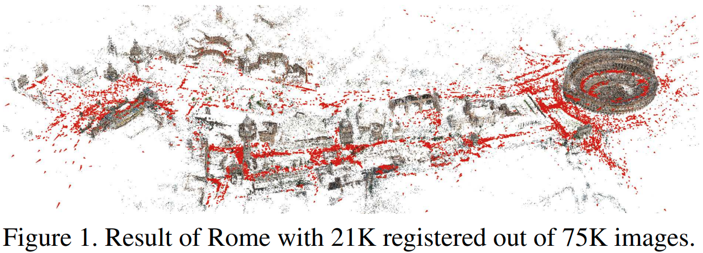

# Structure-From-Motion-Revisited

## 摘要

增量sfm是从无序图像集合进行 3D 重建的一种普遍策略。虽然增量重建系统在所有方面都取得了巨大进步，但稳健性、准确性、完整性和可扩展性仍然是构建真正通用pipeline的关键问题。我们提出了一种新的 SfM 技术，该技术改进了现有技术，朝着这一最终目标迈出了更进的一步。完整的重建pipeline作为开源实现向公众发布。

## 1.引言

多年来，来自无序图像的运动结构 (SfM) 已经取得了巨大的发展。早期的自校准度量重建系统 [42、6、19、16、46] 是第一个无序互联网照片集 [47、53] 和城市场景 [45] 系统的基础。受这些作品的启发，已经开发出越来越大规模的重建系统，用于数十万 [1] 和数百万 [20、62、51、50] 到最近的一亿互联网照片 [30]。已经提出了各种 SfM 策略，包括增量 [53、1、20、62]、分层 [23] 和全局方法 [14、61、56]。可以说，增量 SfM 是最流行的无序照片集重建策略。尽管它被广泛使用，我们仍然没有完成设计一个真正通用的 SfM 系统。虽然现有系统极大地提高了技术水平，但稳健性、准确性、完整性和可扩展性仍然是增量 SfM 中的关键问题，阻碍了其作为通用方法的使用。在本文中，我们提出了一种新的 SfM 算法来实现这一最终目标。新方法在各种具有挑战性的数据集上进行了评估，并将代码作为名为 COLMAP 的开源实现贡献给研究社区，网址为 https://github.com/colmap/colmap.

## 2.回顾SFM

SfM 是将从投影到一系列从不同视点拍摄的图像重建3D结构的过程。增量 SfM（在本文中表示为 SfM）是一种具有迭代重建组件的顺序处理pipeline（图 2）。它通常从特征提取和匹配开始，然后是几何验证。生成的场景图作为重建阶段的基础，在逐步注册新图像、三角测量场景点、过滤异常值并使用捆集调整 (BA) 改进重建之前，该阶段使用精心选择的双视图重建为模型播种。以下部分详细说明了这一过程，定义了整篇论文中使用的符号，并介绍了相关工作。

### 2.1 Correspondence Search

第一阶段是匹配搜索，它在输入图像$I = \{I_i \ | \ i = 1 \dots N_I\}$中发现场景重叠，并识别重叠图像中相同点的投影。输出是一组经过几何验证的图像对$\bar{C}$和每个点图像投影的图。

**特征提取**	对于每个图像$I_i$，SfM 检测由表达描述符$f_j$表示的位置$x_j \in \mathbb{R}^2$处的局部特征集合$F_i = \{ (x_j, f_j) \ | \ j = 1 \dots N_{F_i} \}$。这些特征在辐射和几何变化下应该是不变的，因此 SfM 可以在多个图像中唯一地识别它们 [41]。 SIFT [39]、它的衍生物 [59] 和最近学习的特征 [9] 是稳健性方面的黄金标准。或者，二进制特征以降低鲁棒性为代价提供更好的效率 [29]。

**匹配**	接下来，SfM 通过利用特征$F_i$作为图像的表达描述符来发现看到相同场景部分的图像。朴素的方法测试每个图像对的场景重叠；它通过为图像$I_b$中的每个特征找到图像$I_a$中最相似的特征来搜索特征匹配关系，使用相似性度量比较特征的表达$f_j$。这种方法的计算复杂度为$O(N_I^2N_{F_i}^2)$，并且对于大型图像集合来说是禁止的。多种方法解决了可扩展和高效匹配的问题 [1、20、37、62、28、49、30]。输出是一组可能重叠的图像对$C = \{ \{ I_a, I_b \} \ | \ I_a, I_b \in I, a < b \}$及其相关的特征匹配$M_{ab} \in F_a \times F_b$。

**几何验证**	第三阶段验证可能重叠的图像对 C。由于匹配仅基于外观，因此不能保证匹配的特征实际上映射到同一场景点。因此，SfM 通过尝试估计一个变换使用投影几何在图像之间映射特征点来验证匹配。根据图像对的空间配置，不同的映射描述了它们的几何关系。单应性 H 描述了捕捉平面场景的纯旋转或移动相机的变换 [26]。对极几何 [26] 通过本质矩阵 E（已校准）或基本矩阵 F（未校准）描述了移动相机的关系，并且可以使用三焦点张量 [26] 扩展到三个视图。如果有效的变换在图像之间映射了足够数量的特征，则它们被认为是几何验证的。由于来自匹配的对应关系通常受到异常值污染，因此需要稳健的估计技术，例如 RANSAC [18]。该阶段的输出是一组经过几何验证的图像对$\bar{C}$、它们相关联的内点匹配$\bar{M}_{ab}$，以及可选的对它们的几何关系的描述$G_{ab}$。为了确定适当的关系，可以使用 GRIC [57] 等决策标准或 QDEGSAC [21] 等方法。这个阶段的输出是一个所谓的场景图 [54、37、48、30]，其中图像作为节点，经过验证的图像对作为边。

### 2.2 Incremental Reconstruction

重建阶段的输入是场景图。输出对于注册图像是姿态估计$P = \{ P_c \in SE(3) \ | \ c = 1 \dots N_P \}$和对于重建的场景结构是一组点$X = \{ X_k \in \mathbb{R}^3 \ | \ k = 1 \dots N_x \}$。

**初始化**	SfM 使用精心选择的双视图重建 [7, 52] 来初始化模型。选择合适的初始对很关键，因为重建可能永远不会从错误的初始化中恢复。此外，重建的鲁棒性、准确性和性能取决于增量过程的种子位置。从具有许多重叠相机的图像图中的密集位置初始化通常会由于增加的冗余而导致更稳健和准确的重建。相比之下，从较稀疏的位置初始化会导致较低的运行时间，因为 BA 处理在重建过程中累积的整体稀疏问题

**图像注册**	从度量重建开始，可以通过使用与已注册图像中三角点的对应特征（2D-3D 对应）来解决Perspective-n-Point (PnP) 问题 [18]，从而将新图像注册到当前模型。 PnP 问题涉及估计姿态 $P_c$，对于未校准的相机，还涉及其内参。因此，集合 P 扩展了新注册图像的姿态 $P_c$。由于 2D-3D 对应关系通常受到异常值污染，因此通常使用 RANSAC 和最小姿态求解器来估计校准相机的姿态，例如[22, 34]。对于未校准的相机，各种最小求解器，例如[10]，或基于抽样的方法，例如[31]，存在。我们提出了一种新颖的稳健的下一个最佳图像选择方法，用于在第 4.2 节中进行准确的姿态估计和可靠的三角测量。

**三角测量**	新注册的图像必须观察现有的场景点。此外，它还可以通过三角测量扩展点集 X 来增加场景覆盖范围。一旦注册了至少一张同样覆盖新场景部分但来自不同视点的图像，就可以对新场景点$X_k$进行三角测量并将其添加到 X。三角测量是 SfM 中的关键步骤，因为它通过冗余 [58] 提高了现有模型的稳定性，并通过提供额外的 2D-3D 对应关系来实现新图像的注册。存在大量用于多视图三角测量的方法 [27、5、25、35、40、3、44、32]。这些方法在 SfM 中使用的鲁棒性有限或计算成本高，我们通过在第 4.3 节中提出一种鲁棒且有效的三角测量方法来解决这个问题。

**Bundle Adjustment** 	图像注册和三角测量是独立的过程，尽管它们的乘积高度相关——相机姿态的不确定性会传播到三角测量点，反之亦然，额外的三角测量可能会通过增加冗余来改善初始相机姿态。如果不进一步优化，SfM 通常会迅速漂移到不可恢复的状态。 BA [58] 是摄像机参数$P_c$和点参数$X_k$的联合非线性优化，可最小化重投影误差。
$$
E = \sum_j \rho_j(||\pi(P_c,X_k) - x_j||_2^2)
$$
使用将场景点投影到图像空间的函数$\pi$和损失函数中降低潜在异常值的权重$\rho_j$。 Levenberg-Marquardt [58, 26] 是解决 BA 问题的首选方法。 BA 问题中参数的特殊结构激发了 Schur 补码技巧 [8]，其中首先解决简化的相机系统，然后通过反向替换更新点。这种方案通常更有效，因为摄像机的数量通常小于点的数量。求解系统有两种选择：精确步长算法和不精确步长算法。精确方法通过将系统存储和分解为空间复杂度为 O($N_P^2$) 和时间复杂度为 O($N_P^3$) 的密集或稀疏矩阵 [13, 38] 来求解系统。不精确的方法通常通过使用迭代求解器来近似求解系统，例如预处理共轭梯度 (PCG)，具有 O($N_P$) 时间和空间复杂度 [4, 63]。直接算法是多达数百台摄像机的首选方法，但它们在大规模设置中过于昂贵。虽然稀疏直接方法在很大程度上降低了稀疏问题的复杂性，但由于通常更密集的连接图 [54、4]，它们对于大型非结构化照片集来说是令人望而却步的。在这种情况下，间接算法是首选方法。特别是对于 Internet 照片，BA 花费大量时间优化许多近似重复的图像。在4.5节，我们提出了一种识别和参数化高度重叠图像的方法，以实现密集集合的高效 BA。

## 3.挑战

虽然当前最先进的 SfM 算法可以处理大规模 Internet 照片集合中图像的多样化和复杂分布，但它们在完整性和鲁棒性方面常常无法产生完全令人满意的结果。通常，系统无法配准根据经验应该配准的大部分图像 [20、30]，或者系统会由于配准错误或漂移而产生损坏的模型。首先，这可能是由匹配搜索产生不完整的场景图引起的，例如由于匹配近似，因此既没有为完整模型提供必要的连接性，也没有为可靠估计提供足够的冗余。其次，这可能是由重建阶段中由于场景结构缺失或不准确而未能配准图像造成的——图像配准和三角测量具有共生关系，因为图像只能配准到现有的场景结构，而场景结构只能从已配准的图像中进行三角测量 [64]。在增量重建过程中的每个步骤中最大限度地提高两者的准确性和完整性是 SfM 中的一个关键挑战。在本文中，我们解决了这一挑战，并在完整性、稳健性和准确性方面显着改进了当前技术水平（第 5 节）的结果，同时提高了效率

## 4.贡献

本节介绍了一种改进 SfM 中主要挑战的新算法。首先，我们引入了一种几何验证策略，该策略通过信息增强场景图，从而提高初始化和三角测量组件的稳健性。其次，下一个最佳视图选择最大化增量重建过程的鲁棒性和准确性。第三，一种稳健的三角测量方法，可以在降低计算成本的情况下产生比现有技术更完整的场景结构。第四，迭代 BA、重新三角测量和异常值过滤策略，通过减轻漂移效应显着提高完整性和准确性。最后，通过冗余视图挖掘对密集照片集进行更有效的 BA 参数化。这导致系统在稳健性和完整性方面明显优于当前的技术水平，同时保持其效率。我们对比了我们对当前最先进系统 Bundler（开源）[52] 和 VisualSFM（闭源）[62] 的贡献。所提出的系统作为开源实现发布。

### 4.1 场景图增强

我们提出了一种多模型几何验证策略，以使用适当的几何关系来扩充场景图。首先，我们估计一个基本矩阵。如果至少找到$N_F$个内点，我们认为该图像对已通过几何验证。接下来，我们通过确定同一图像对的单应性内点的数量$N_H$来对转换进行分类。为了近似像 GRIC 这样的模型选择方法，如果$N_H/N_F < \varepsilon_{HF}$，我们假设一个移动的相机在一个通用场景中。对于校准图像，我们还估计了一个本质矩阵及其内点$N_E$的数量。如果$N_E / N_F > \varepsilon_{EF}$，我们假设校准正确。在正确校准且$N_H/N_F < \varepsilon_{HF}$的情况下，我们分解本质矩阵，从内点匹配对点进行三角测量，并确定中值三角测量角$\alpha_m$。使用$\alpha_m$，我们区分纯旋转（全景）和平面场景（平面）的情况。此外，互联网照片中的一个常见问题是水印、时间戳和帧 (WTF) [60, 30] 错误地链接了不同地标的图像。我们通过估计图像边界处的内点$N_S$的相似性变换来检测此类图像对。任何具有$N_s / N_F > \varepsilon_{SF} \vee N_S / N_E > \varepsilon_{SE}$的图像对都被认为是 WTF，不会插入到场景图中。对于有效对，我们将场景图标记为模型类型（通用、全景、平面）以及具有最大支持$N_H,N_E$或$N_F$的模型的内点。模型类型用于仅从非全景图像对和优选校准图像对中播种重建。已经增强的场景图能够有效地找到鲁棒重建过程的最佳初始化。此外，我们不对全景图像对进行三角测量以避免退化点，从而提高三角测量和后续图像配准的稳健性。

### 4.2 下一个最佳视图选择

下一个最佳视图规划已经在计算机视觉、摄影测量和机器人技术领域进行了研究 [12]。在稳健的 SfM 中选择下一个最佳视图旨在最小化重建误差 [17, 24]。在这里，我们提出了一种有效的下一个最佳视图策略，遵循一种最大化重建鲁棒性的不确定性驱动方法。

选择下一个最佳视图至关重要，因为每个决定都会影响剩余的重建。一个错误的决定可能会导致一连串的相机错误注册和错误的三角测量。此外，选择下一个最佳视图会极大地影响位姿估计的质量以及三角测量的完整性和准确性。准确的位姿估计对于稳健的 SfM 至关重要，因为如果位姿不准确，点三角测量可能会失败。选择下一个最佳视图的决定具有挑战性，因为对于互联网照片集，通常没有关于场景覆盖和相机参数的先验信息，因此该决定完全基于从外观 [17]、两视图匹配关系，以及增量重建的场景 [53、24]中得出的信息。

一种流行的策略是选择能看到最多三角测量点的图像 [52]，目的是最大限度地减少相机切除的不确定性。Haner等人[24] 提出了一种不确定性驱动的方法，可以最大限度地减少重建误差。通常，会选择看到最多三角测量点的相机，除非观测配置条件不佳。为此，Lepetit 等人 [34] 实验表明，使用 PnP 的相机位姿的准确性取决于观察的数量及其在图像中的分布。对于互联网照片，标准的 PnP 问题被扩展到在先验校准缺失或不准确的情况下对内参的估计。大量的 2D-3D 对应关系为这种估计提供了冗余 [34]，而点的均匀分布避免了错误的配置，并实现了对内参的可靠估计 [41]。

下一个最佳视图的候选者是至少看到$N_t > 0$个三角测量点的尚未注册的图像。使用特征轨迹图可以有效地跟踪此统计信息。对于 Internet 数据集，此图可能非常密集，因为许多图像可能会看到相同的结构。因此，在重建的每一步都有许多候选视图可供选择。 Haner 等人提出的详尽协方差传播是不可行的，因为需要在每个步骤中为每个候选者计算和分析协方差。我们提出的方法使用高效的多分辨率分析来近似他们的不确定性驱动方法。

我们必须同时跟踪每个候选图像中可见点的数量及其分布。更多的可见点和这些点的更均匀分布应该导致更高的分数 S [31]，这样具有更好条件的可见点配置的图像首先被注册。为了实现这个目标，我们将图像离散化为一个固定大小的网格，在两个维度上都有$K_l$个bins。每个单元格有两种不同的状态：空和满。每当空单元格中的一个点在重建过程中变得可见时，单元格的状态就会变为满，并且图像的得分$S_i$会增加一个权重$w_l$。通过这个方案，我们量化了可见点的数量。由于单元格只对总分贡献一次，因此我们更倾向于在点聚集在图像的一部分中的情况下更均匀地分布（即只有少数单元格包含所有可见点）。但是，如果可见点的数量为$N_t \ll K_l^2$，则此方案可能无法很好地捕获点的分布，因为每个点都可能落入单独的单元格中。因此，我们通过在每个连续级别使用更高分辨率$K_l = 2^l$对图像进行分区，将先前描述的方法扩展到具有$l = 1 \dots L$级别的多分辨率金字塔。得分在所有级别上累积，权重$w_l = K_l^2$与分辨率相关。该数据结构及其分数可以有效地在线更新。图 3 显示了不同配置的分数，第5节展示了使用该策略改进的重建鲁棒性和准确性。

### 4.3 鲁棒高效的三角测量

特别是对于稀疏匹配的图像集合，利用传递匹配可以提高三角测量的完整性和准确性，从而改善后续图像配准。近似匹配技术通常倾向于外观相似的图像对，因此双视图匹配通常源于具有小基线的图像对。利用传递性在具有较大基线的图像之间建立匹配关系，从而实现更准确的三角测量。因此，我们通过连接两个视图的匹配关系来形成特征轨迹。

已经提出了多种方法用于从嘈杂的图像观察中进行多视图三角测量 [27、40、5]。虽然一些提议的方法对一定程度的异常值污染具有鲁棒性 [25、35、3、44、32]，但据我们所知，没有一种方法可以处理特征轨迹中经常出现的高异常值比率（图6)。我们指的是 Kang 等人[32] 详细概述了现有的多视图三角测量方法。在本节中，我们提出了一种有效的、基于采样的三角测量方法，该方法可以稳健地估计异常值污染特征轨迹中的所有点。

由于对沿对极线的模糊匹配的错误双视图验证，特征轨迹通常包含大量异常值。单个不匹配会合并两个或多个独立点的轨迹。例如，错误地合并四个长度相等的特征轨迹会导致 75% 的异常值比率。此外，由于高重投影误差，不准确的相机位姿可能会使轨迹元素无效。因此，对于稳健的三角测量，有必要在使用多个视图执行细化之前找到一组一致的轨迹元素。此外，为了从错误合并中恢复特征轨迹的潜在多个点，递归三角测量方案是必要的。

Bundler 对轨道元素的所有成对组合进行采样，执行双视图三角测量，然后检查是否至少有一个解决方案具有足够的三角测量角度。如果找到条件良好的解决方案，则对整个轨迹进行多视图三角测量，如果所有观测都通过cheirality constraint [26]，则接受该解决方案。这种方法对异常值不稳健，因为不可能恢复合并到一个轨迹中的独立点。此外，由于详尽的成对三角测量，它具有显着的计算成本。我们的方法克服了这两个限制。

为了处理任意级别的异常值污染，我们使用 RANSAC 制定了多视图三角测量问题。我们考虑特征轨迹$T = \{ T_n | n = 1 \dots N_T \}$作为一组具有先验未知内点比率$\epsilon$的测量值。测量$T_n$由归一化图像观察$\bar{x}_n \in \mathbb{R}^2$和相应的相机位姿$P_n \in SE(3)$组成，定义从世界到相机框架的投影$P = [R^T -R^Tt]$其中$R \in SO(3)$和$t \in \mathbb{R}^3$。我们的目标是最大限度地支持符合条件良好的双视图三角测量的测量值。
$$
X_{ab} \sim \tau(\hat{x}_a, \hat{x}_b, P_a, P_b) with \  a \neq b,
$$
其中$\tau$是任何选择的三角测量方法（在我们的例子中是 DLT 方法 [26]），$X_{ab}$是三角测量点。请注意，我们不会从全景图像对（第 4.1 节）进行三角测量，以避免由于姿势估计不准确而导致错误的三角测量角度。条件良好的模型满足两个约束。首先，足够的三角测量角度$\alpha$
$$
\cos\alpha = \frac{t_a - X_{ab}}{||t_a - X_{ab}||_2} \cdot \frac{t_b - X_{ab}}{||t_b - X_{ab}||_2}.
$$
其次，正深度$d_a$和$d_b$ w.r.t.视图$P_a$和$P_b$（cheirality constraint），深度定义为
$$
d=[p_{31} \ p_{32} \ p_{33} \ p_{34}][X^T_{ab} \ 1]^T,
$$
其中$p_{mn}$表示 P 的第 m 行和第 n 列中的元素。认为测量$T_n$符合模型，如果测量$T_n$具有正深度$d_n$并且如果其重投影误差
$$
e_n = ||\bar{x}_n - \left[\begin{matrix}x^{\prime}/z^{\prime} \\ y^{\prime}/z^{\prime}\end{matrix}\right]||_2 \ with \ \left[\begin{matrix} x^{\prime} \\ y^{\prime} \\ z^{\prime}\end{matrix}\right] = P_n\left[\begin{matrix}X_{ab} \\ 1\end{matrix}\right]
$$
小于某个阈值 t。 RANSAC 将 K 最大化作为一种迭代方法，并且通常它会随机均匀地对大小为 2 的最小集合进行采样。但是，由于对于小$N_T$可能会多次采样相同的最小集，因此我们将随机采样器定义为仅生成唯一样本。为确保使用置信度$\eta$至少对一个无离群值的最小集进行采样，RANSAC 必须至少运行 K 次迭代。由于先验内点比率未知，我们将其设置为较小的初始值$\epsilon_0$并在我们找到更大的共识集（自适应停止标准）时调整 K。因为特征轨迹可能包含多个独立点，所以我们通过从剩余测量中删除共识集来递归地运行此过程。如果最新共识集的大小小于三，则递归停止。第5节中的评估证明了所提出方法在降低计算成本的情况下增加了三角测量的完整性。

### 4.4 Bundle Adjustment

为了减少累积误差，我们在图像配准和三角测量后执行 BA。通常，不需要在每个步骤之后执行全局 BA，因为增量 SfM 只会影响局部模型。因此，我们在每次图像配准后对连接最多的图像集执行局部 BA。类似于 VisualSFM，我们仅在将模型增长一定百分比后才执行全局 BA，从而导致 SfM 的平摊线性运行时间。

**参数化**	为了考虑潜在的异常值，我们使用 Cauchy 函数作为局部 BA 中的稳健损失函数$\rho_j$。对于几百个摄像头的问题，我们使用稀疏直接求解器，对于更大的问题，我们依赖 PCG。我们使用 Ceres Solver [2] 并提供在任意图像组合之间共享任意复杂度相机模型的选项。对于无序的互联网照片，我们依赖于具有一个径向畸变参数的简单相机模型，因为估计依赖于纯粹的自校准。

**过滤**	BA 之后，一些观察结果与模型不符。因此，我们过滤具有较大重投影误差的观测值 [53、62]。此外，对于每个点，我们通过在所有成对的观察光线上强制执行最小三角测量角度来检查条件良好的几何形状 [53]。在全局 BA 之后，我们还检查退化相机，例如由全景图或人工增强图像引起的。通常，这些相机只有离群值观测值，或者它们的内参会收敛到一个虚假的最小值。因此，我们不将焦距和失真参数限制在先验固定范围内，而是让它们在 BA 中自由优化。由于主点校准是一个病态问题[15]，我们将其固定在未校准相机的图像中心。具有异常视野或大失真系数幅度的相机被认为是错误估计并在全局BA之后被过滤。

**重新三角测量**	类似于 VisualSfM，我们执行重新三角测量 (RT) 以在全局 BA（pre-BA RT）之前考虑漂移效应。然而，BA 通常会显着改善相机和点参数。因此，我们建议通过额外的post-BA RT步骤来扩展非常有效的pre-BA RT。此步骤的目的是通过继续跟踪以前未能三角化的点（例如，由于不准确的位姿等）来提高重建的完整性（比较第 4.3 节）。我们不增加三角化阈值，而是继续跟踪具有误差低于过滤阈值的观测值。此外，我们尝试合并轨迹，从而为下一个 BA 步骤提供更多的冗余。

**迭代优化**	Bundler 和 VisualSfM 执行 BA 和过滤的单个实例。由于漂移或pre-BA RT，通常 BA 中的大部分观察结果是异常值，随后被过滤掉。由于 BA 受到异常值的严重影响，因此 第二步BA 可以显着改善结果。因此，我们建议在迭代优化中执行 BA、RT 和过滤，直到过滤的观察值和post-BA RT点的数量减少。在大多数情况下，第二次迭代后结果会显着改善并且优化会收敛。第5节表明所提出的迭代细化显着提高了重建的完整性。

### 4.5 冗余视图挖掘

BA 是 SfM 中的主要性能瓶颈。在本节中，我们提出了一种方法，该方法利用增量 SfM 和密集照片集合的固有特性，通过将冗余相机聚类到高场景重叠组中来更有效地参数化 BA。

由于兴趣点的受欢迎程度不同，网络照片集通常具有高度不统一的可见性模式。此外，无序集合通常聚集成在许多图像中共同可见的点片段。许多以前的工作利用这一事实来提高 BA 的效率，包括 Kushal 等人[33] 分析了可见性模式以有效预处理减少的相机系统。Ni等[43]将摄像机和点划分为子图，子图通过分隔符变量连接，将划分作为连接摄像机和点参数图上的图割问题。然后 BA 在固定相机和点和改进分隔符变量之间交替，反之亦然。 Carlone 等人的另一种方法[11] 将具有低秩的多个点折叠为单个因素，对相机施加高秩约束，从而在相机共享许多点时提供计算优势。

我们提出的方法是受这些先前工作的启发。与 Ni 等人类似，我们将问题划分为内参被分解的子图。我们有三个主要贡献：首先，一种有效的相机分组方案利用了 SfM 的固有特性并取代了 Ni 等人采用的昂贵的图割。其次，我们不是将许多摄像机聚类到一个子图中，而是将场景划分为许多小的、高度重叠的摄像机组。每组内的相机被折叠成单个相机，从而降低解决缩减相机系统的成本。第三，由于更小、高度重叠的相机组，我们消除了 Ni 等人的交替方案。通过跳过分隔符变量优化。

SfM 根据图像和点的参数是否受到最新增量模型扩展的影响，将图像和点分为两组。对于大问题，大部分场景不受影响，因为模型通常在局部扩展。 BA 自然会针对新扩展的部分进行更多优化，而其他部分只会在漂移的情况下进行改进 [62]。此外，互联网照片集通常相机分布不均匀，有许多冗余视点。受这些观察的启发，我们将未受影响的场景部分划分为高度重叠图像的组$\mathcal{G}=\{G_r|r=1\dots N_G\}$，并将每个组$G_r$参数化为单个相机。受最新扩展影响的图像被独立分组，以允许对其参数进行最佳细化。请注意，这会导致标准 BA 参数化（等式 1）。对于未受影响的图像，我们创建基数$N_{G_r}$组。如果图像是在最新的模型扩展期间添加的，或者如果超过$\epsilon_r$的观测值重投影误差大于r个像素（以改进重新三角化相机），我们认为图像受到影响。

一组内的图像应尽可能冗余[43]，图像之间的共同可见点的数量是描述它们相互影响程度的度量[33]。对于具有$N_x$个点的场景，每个图像都可以用二进制可见性向量$v_i \in \{0, 1\}^{N_x}$来描述，其中如果点$X_n$在图像 i 中可见，则$v_i$中的第n项为 1，否则为 0。图像 a 和 b 之间的交互程度是对它们的向量$v_i$的按位运算计算得到的
$$
V_{ab} = ||v_a \wedge v_b || \ /  \ ||v_a \vee v_b||
$$
为了构建组，我们将图像排序为$\bar{\mathcal{I}} = \{ I_i \ | \ ||v_i|| \geq ||v_{i + 1}||\}$。我们通过从$\bar{\mathcal{I}}$中删除第一个图像$I_a$并找到使$V_{ab}$最大化的图像$I_b$来初始化组$G_r$。如果$V_{ab} > V$且$|G_r| < S$，图像$I_b$从$\bar{\mathcal{I}}$中移除并添加到组$G_r$中。否则，将初始化一个新组。为了减少寻找$I_b$的时间，我们采用启发式方法将搜索限制在 $K_r$空间最近邻，其共同观察方向在$\pm \beta$度范围内，其动机是这些图像很可能共享许多点。

然后对组中的每个图像进行参数化 w.r.t.一个共同的组局部坐标系。分组图像的 BA 成本函数（等式 1）是
$$
E_g = \sum_j{\rho_j(||\pi_g(G_r, P_c, X_k) - x_j||^2_2)}
$$
使用外参组参数$G_r \in SE(3)$和固定的$P_c$。然后将组 r 中图像的投影矩阵定义为组和图像位姿$P_{cr}=P_cG_r$的串联。总成本$\bar{E}$是分组和未分组成本贡献的总和。为了有效连接$G_r$和$P_i$的旋转分量，我们依赖四元数。由于计算$\pi_g$相对于$\pi$的相对开销较小，因此较大的组大小会带来更大的性能优势。请注意，即使对于两个组的情况，我们也观察到了计算优势。此外，性能优势取决于问题的大小，因为摄像机数量的减少对直接方法的立方计算复杂度的影响大于间接方法的线性复杂度（第 2 节）。

## 5.实验

我们在各种数据集上进行实验，以评估所提出的组件和整个系统与最先进的增量（Bundler [53]、VisualSFM [62]）和全局 SfM 系统（DISCO [14]、Theia[55] (1.Theia 的结果由作者友情提供)）。这 17 个数据集包含总共 144,953 张无序的互联网照片，分布在一个大区域并且相机密度变化很大。此外，Quad [14] 具有ground truth相机位置。在所有实验中，我们使用 RootSIFT 特征并使用在不相关数据集上训练的词汇树将每个图像与其 100 个最近的邻居进行匹配。为确保不同方法之间的可比性，匹配搜索不包括在具有 256GB RAM 的 2.7GHz 机器上的计时中。

**下一个最佳视图选择**	综合实验（图 4）评估分数 S 反映点数和分布的程度。我们使用 L = 6 个金字塔级别，并生成分布为 σ 和位置为 µ 的高斯分布图像点。较大的 σ 和更中心的 µ 对应于更均匀的分布并正确地产生更高的分数。类似地，当点数很少时得分由点数决定，否则由它们在图像中的分布决定。另一个实验（图 5）在重建误差方面将我们的方法（金字塔）与现有策略进行了比较。其他方法是 Number [53]，它最大化三角测量点的数量，以及 Ratio，它最大化可见点与潜在可见点的比率。在每次图像配准后，我们测量策略之间共享的配准图像数量（交并比）和重建误差作为到ground truth相机位置的中值距离。虽然所有策略都收敛到同一组配准图像，但我们的方法通过为图像选择更好的配准顺序来产生最准确的重建。

**鲁棒高效的三角测量**	在 Dubrovnik 数据集（图 6 和表 2）上进行的一项实验在由 47M 已验证匹配组成的 2.9M 特征轨迹上评估了我们的方法。我们与 Bundler 和对轨迹中所有成对组合进行采样的详尽策略进行了比较。我们设置$\alpha = 2^{\circ}, \ t = 8px$并且$\epsilon_0 = 0.03$。为避免组合爆炸，我们将穷举方法限制为 10K 次迭代，即$\epsilon_{min} \approx 0.02, \eta = 0.999$。不同的内点比率分布（由递归、详尽的方法确定）证明需要稳健的三角测量方法。我们提出的递归方法比非递归方法恢复更长的轨迹和总体上更多的轨迹元素。请注意，基于递归 RANSAC 的方法的更多点对应于略微减少的轨迹长度。基于 RANSAC 的方法产生的轨迹稍差，但速度要快得多（10-40 倍）。通过改变$\eta$，很容易在速度和完整性之间取得平衡。

**冗余视图挖掘**	我们评估了对密集分布图像的无序集合的冗余视图挖掘。图 8 显示了使用固定数量的 BA 迭代次数的全局 BA 中参数化相机的增长率。根据强制场景重叠 V，我们可以显着减少求解缩减相机系统的时间。总运行时间的有效加速为 5% (V = 0.6)、14% (V = 0.3) 和 32% (V = 0.1)，而平均重投影误差从 0.26px（标准 BA）分别降低到 0.27像素，0.28像素和 0.29 像素。对于 V > 0.3 的所有选择，重建质量都具有可比性，对于较小的 V，重建质量会越来越差。使用 V = 0.4，Colosseum 的整个pipeline的运行时间减少了 36%，但导致了等效的重建。

**系统**	表 1 和图 1 展示了整个系统的性能，因此也评估了系统中各个建议组件的性能。对于每个数据集，我们报告最大的重建组件。 Theia 是最快的方法，而我们的方法实现的时间比 VisualSFM 稍差，但比 Bundler 快 50 多倍。图 7 显示了各个模块的相对时序。对于所有数据集，我们在完整性方面明显优于任何其他方法，尤其是对于较大的模型。重要的是，增加的轨迹长度导致 BA 中的冗余度更高。此外，我们实现了 Quad 数据集的最佳姿态精度：DISCO 1.16m、Bundler 1.01m、VisualSFM 0.89m 和 Ours 0.85m。图 9 显示了 Bundler 与我们的方法相比的结果。我们鼓励读者查看补充材料以对结果进行额外的视觉比较，证明我们方法的卓越稳健性、完整性和准确性。

## 6.总结

本文提出了一种 SfM 算法，该算法克服了向通用 SfM 系统迈进的关键挑战。该算法的拟议组件在完整性、鲁棒性、准确性和效率方面提高了现有技术水平。在具有挑战性的大规模数据集上进行的综合实验展示了各个组件和整个系统的性能。整个算法作为开源实现向公众发布。
