# CMake使用

## 实例一

### 1.PROJECT

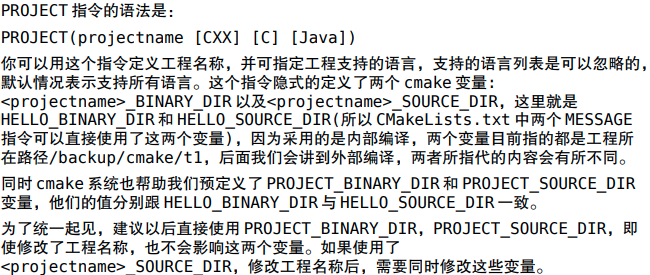

### 2.SET

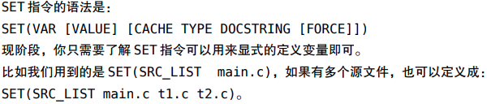

### 3.MESSAGE

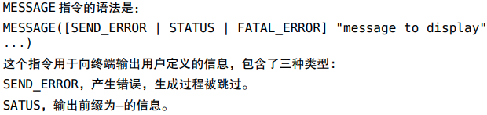

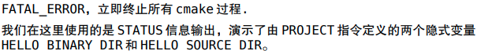

### 4.ADD_EXECUTABLE


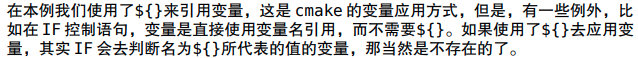

### 5.基本语法规则

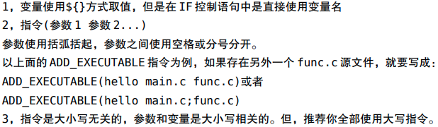

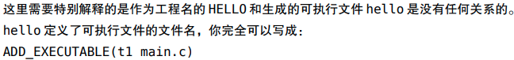

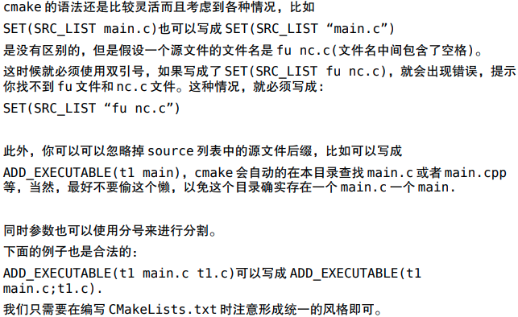

## 实例二

### 1.ADD_SUBDIRECTORY

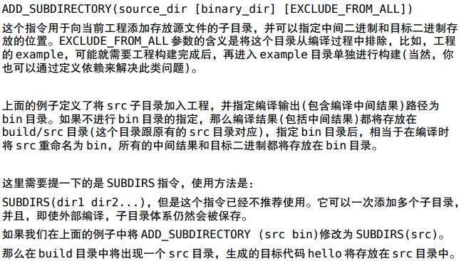

换个地方保存目标二进制

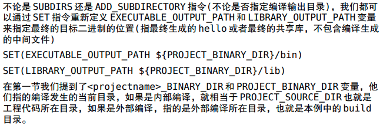

### 2.INSTALL指令

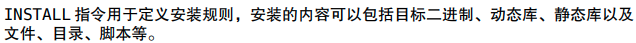

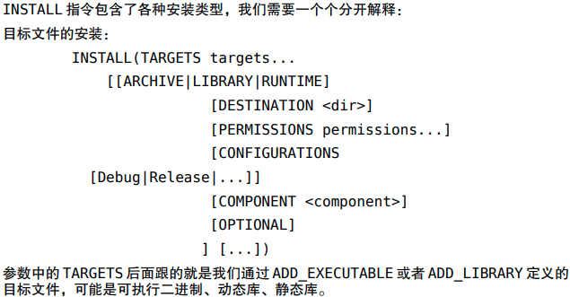

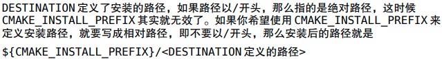

CMAKE_INSTALL_PREFIX的常见使用方法如下所示

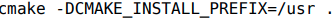

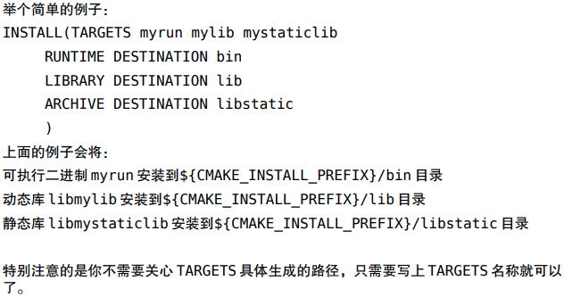

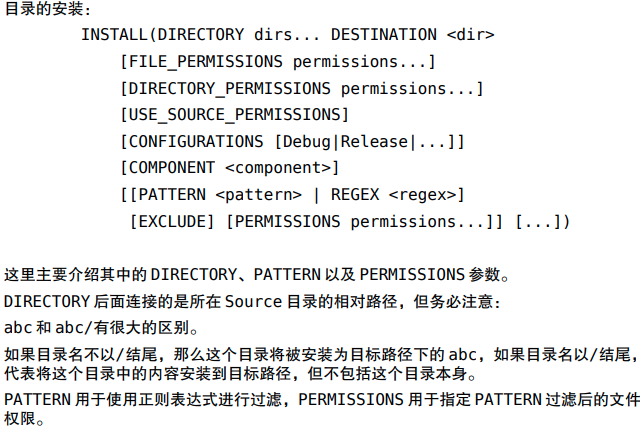

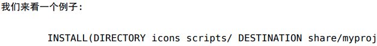

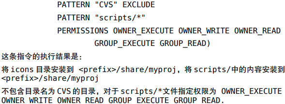

##  实例三

### 1.ADD_LIBRARY

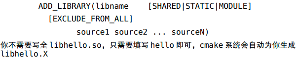

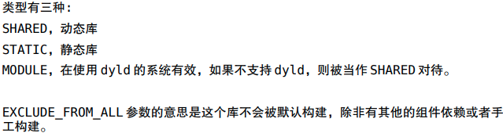

### 2.SET_TARGET_PROPERTIES

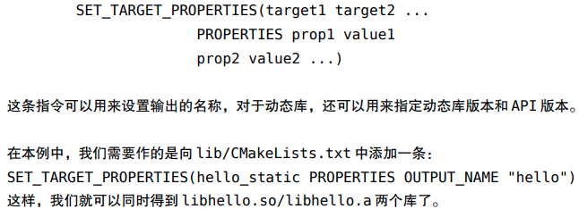


### 3.动态版本号

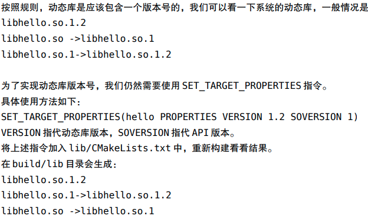

## 实例四

### 1.make查看细节

```cmake
make VERBOSE=1
```

### 2.INCLUDE_DIRECTORIES

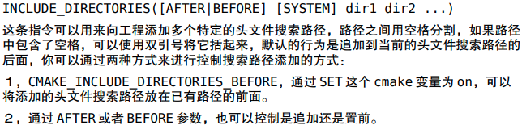

### 3.LINK_DIRECTORIES


### 4.TARGET_LINK_LIBRARIES


### 5.特殊的环境变量CMAKE_INCLUDE_PATH和CMAKE_LIBRARY_PATH

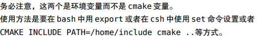

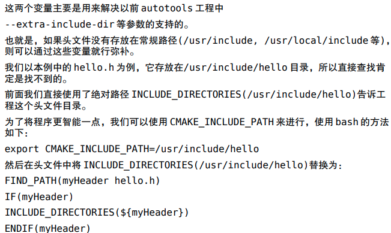

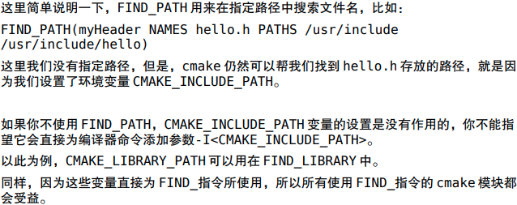

## 常用变量和常用环境变量

### 1.引用方式

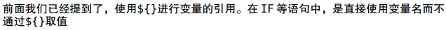

### 2.自定义变量的方式

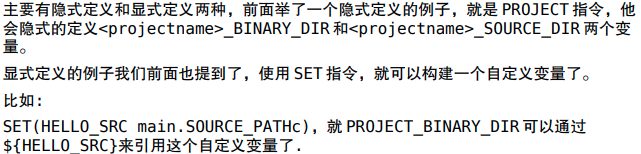

### 3.常用变量

#### 1.CMAKE_BINARY_DIR PROJECT_BINARY_DIR <projectname>_BINARY_DIR

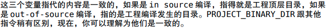

#### 2.CMAKE_SOURCE_DIR PROJECT_SOURCE_DIR <projectname>_SOURCE_DIR

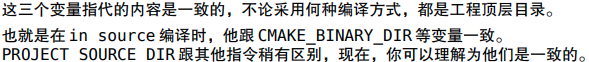

#### 3.CMAKE_CURRENT_SOURCE_DIR

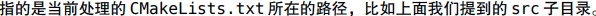

#### 4.CMAKE_CURRENT_BINARY_DIR

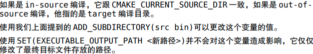

#### 5.CMAKE_CURRENT_LIST_FILE

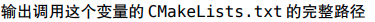

#### 6.CMAKE_CURRENT_LIST_LINE

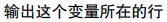

#### 7.CMAKE_MODULE_PATH

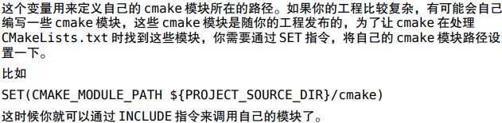

#### 8.EXECUTABLE_OUTPUT_PATH和LIBRARY_OUTPUT_PATH

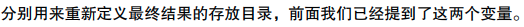

#### 9.PROJECT_NAME

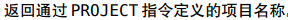

### 4.cmake调用环境变量的方式

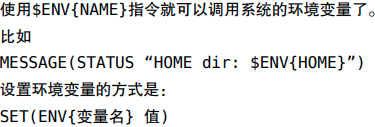

#### 1.CMAKE_INCLUDE_CURRENT_DIR

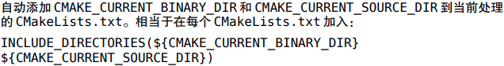

#### 2.CMAKE_INCLUDE_DIRECTORIES_PROJECT_BEFORE

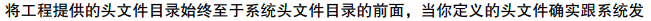

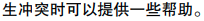

#### 3.CMAKE_INCLUDE_PATH和CMAKE_LIBRARY_PATH

在上一节已经提及。

### 5.系统信息

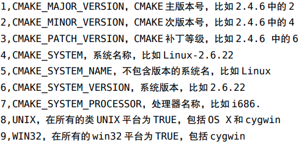

### 6.主要的开关项

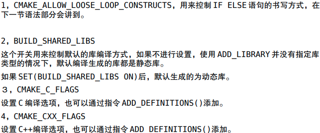

## cmake常用指令

### 一、基本指令

#### 1.ADD_DEFINITIONS


#### 2.ADD_DEPENDENCIES


#### 3.ADD_EXECUTABLE、ADD_LIBRARY、ADD_SUBDIRECTORY

前面已经介绍。

#### 4.ADD_TEST与ENABLE_TESTING指令

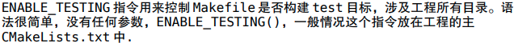

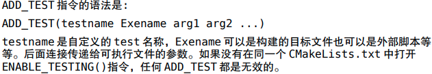

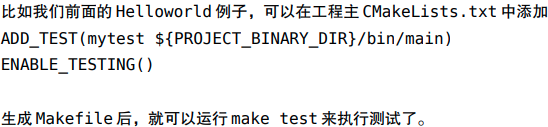

#### 5.AUX_SOURCE_DIRECTORY

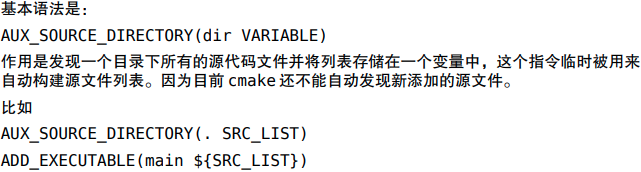

#### 6.CMAKE_MINIMUM_REQUIRED

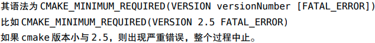

#### 7.EXEC_PROGRAM

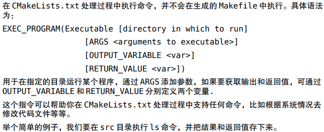

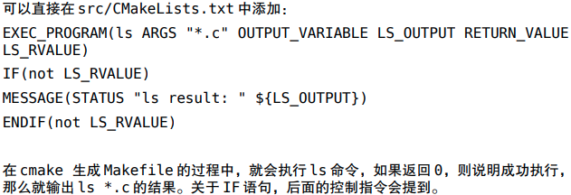

#### 8.FILE指令


#### 9.INCLUDE指令


### 二、INSTALL指令


### 三、FIND_指令


FIND_PACKAGE():

https://zhuanlan.zhihu.com/p/97369704

### 四、控制指令

#### 1.IF指令


#### 2.WHILE


#### 3.FOREACH


