# 概述

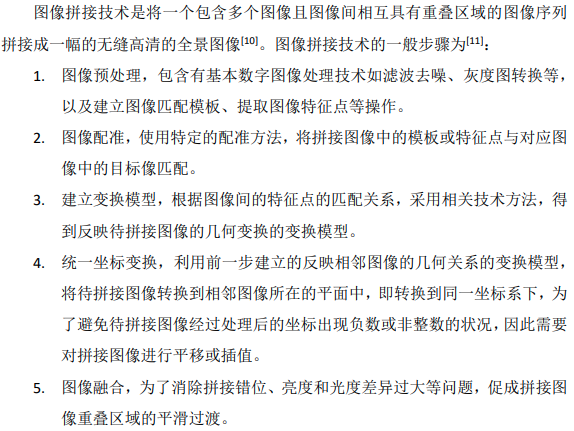

# 单应性矩阵

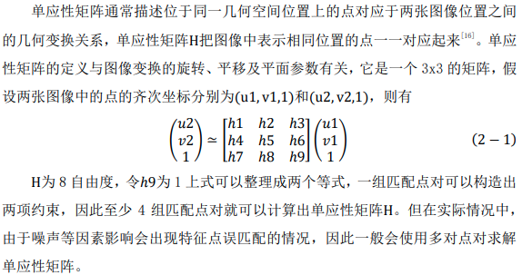

特点:

1. 原点不再是原点；
2. 平行线不再是平行线；
3. 长度比例关系丢失；
4. 两个H相乘依然是H；

相机纯旋转，原点不变，可以准确计算单应性矩阵；当场景与相机很远时，场景就类似于平面，并且相机的位移也可以相对地认为只有旋转。(室外容易拼接，室内困难)

# 网格点提取

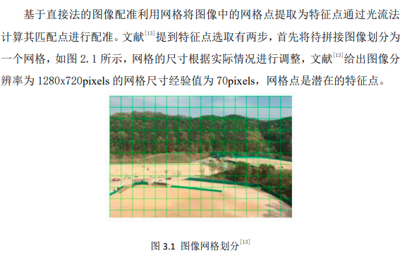

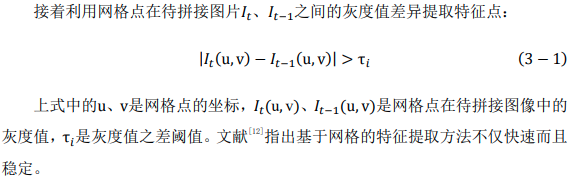

# Lucas-Kande光流法

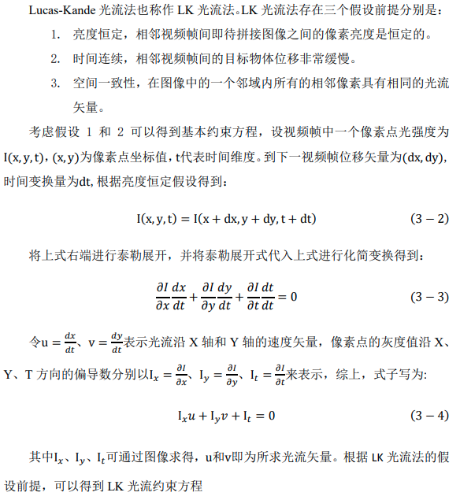

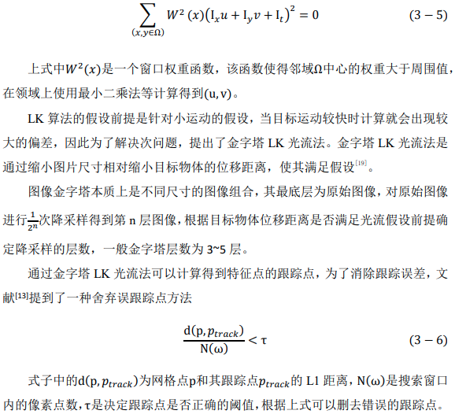

# 最近邻比次近邻特征点匹配

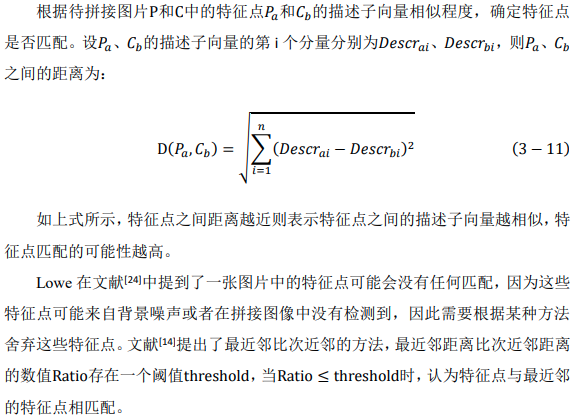

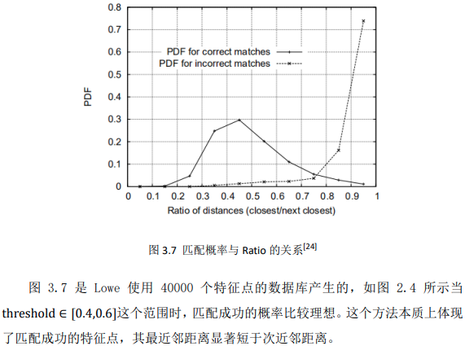

# RANSAC(随机采样一致算法)

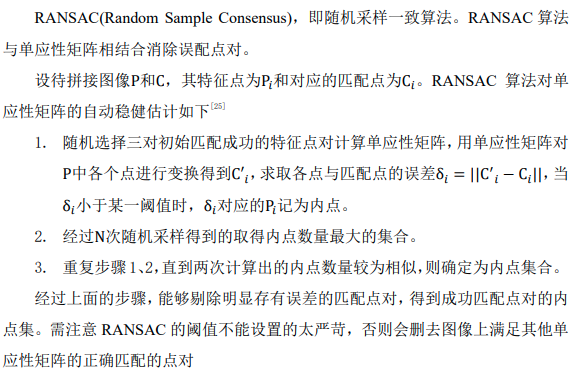

# 图像质量评估方法

## PSNR

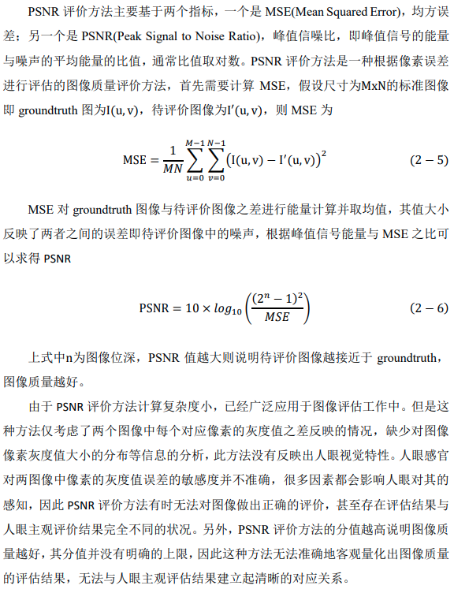

## SSIM

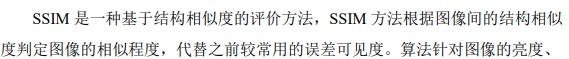

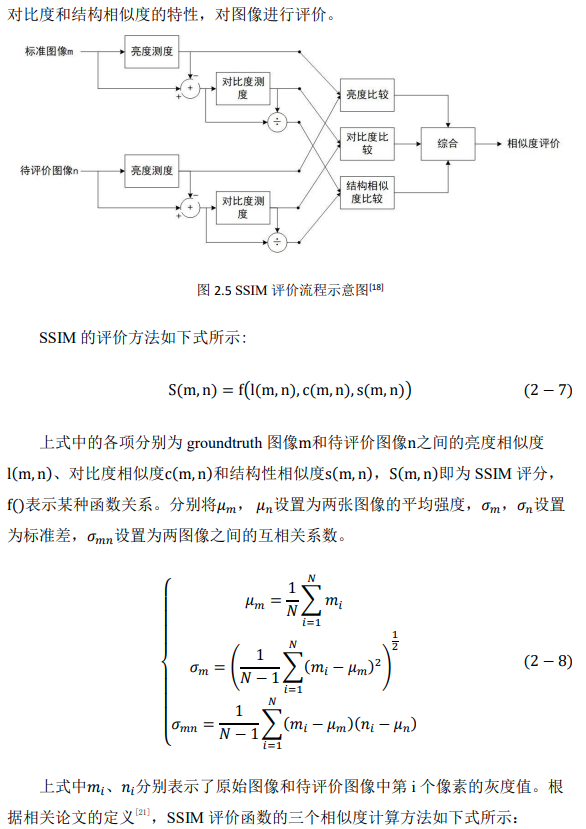

## 国际无线电咨询委员会制订的CCIR500-1主观评价标准

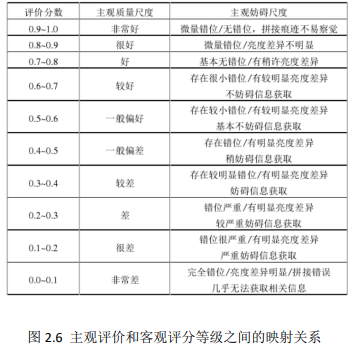

此客观评分为SSIM法的评分结果

# 程序流程

## 视频拼接直接法

## 视频拼接的快速实现算法

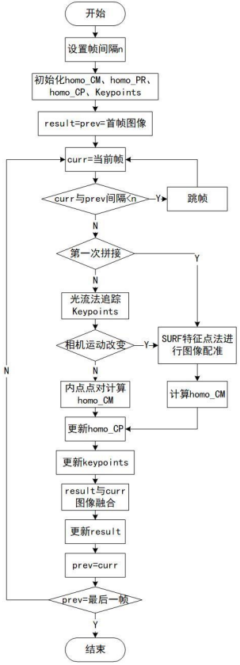