# 数据结构与算法-C++

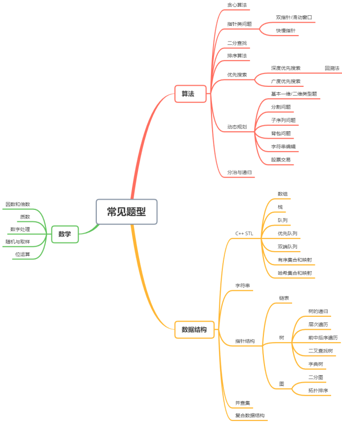

# 复杂度分析

https://zhuanlan.zhihu.com/p/137041568

时间维度：执行当前算法所消耗的时间，通常用时间复杂度来描述

空间复杂度：执行当前算法需要占用多少内存空间，通常用空间复杂度来描述

## 时间复杂度

### 大O符号表示法

T(n)=O(f(n))

其中n表示数据规模，O(f(n))表示运行算法所需要执行的指令数，和f(n)成正比

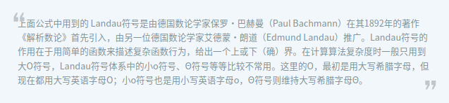

### 常见的时间复杂度量级

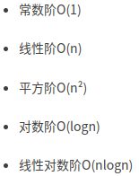

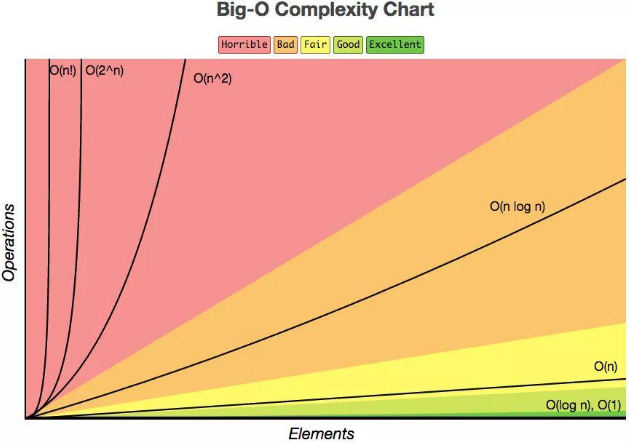

#### O(1)

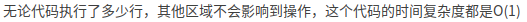

#### O(n)

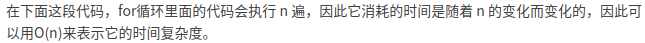

#### O(n^2)

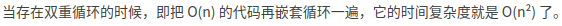

#### O(logn)

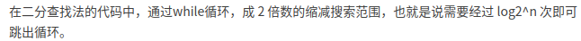

#### O(nlogn)

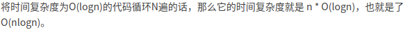

### 递归算法的时间复杂度

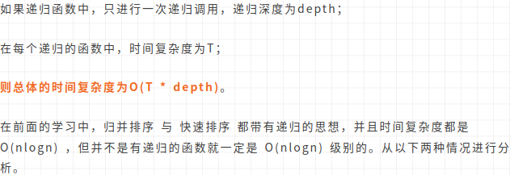

#### 1.递归中进行一次递归调用的复杂度分析

**二分查找**

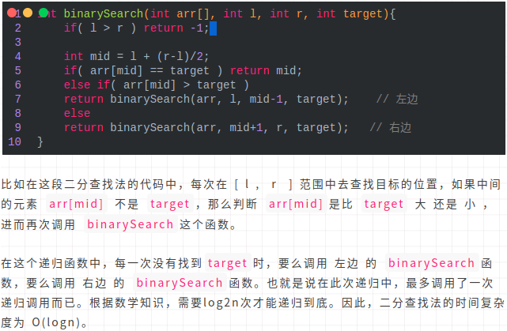

**求和**

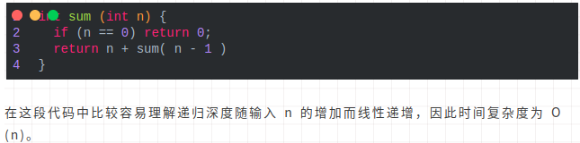

**求幂**

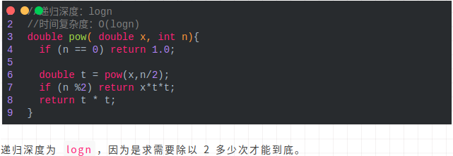

#### 2.递归中进行多次递归调用的复杂度分析

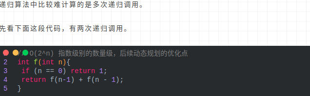

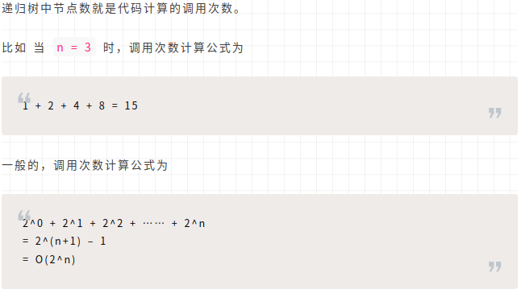

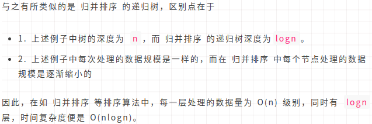

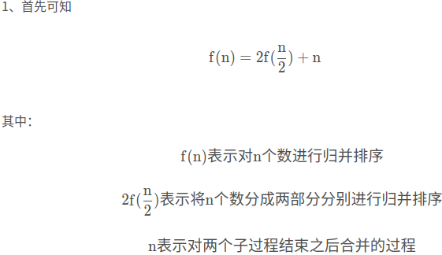

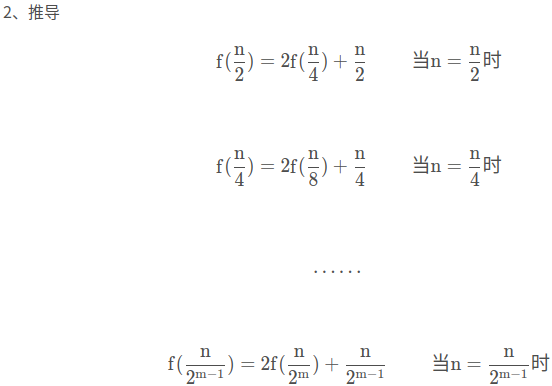

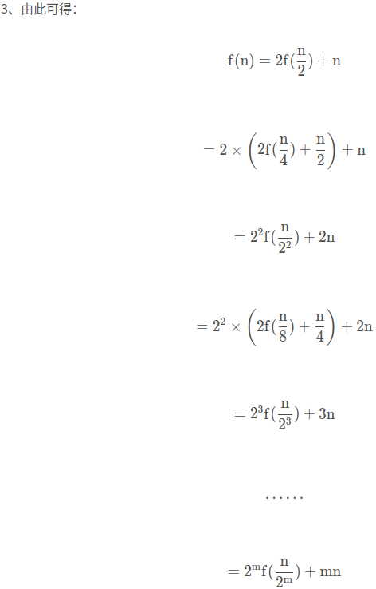

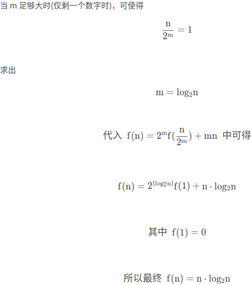

### 最好、最坏情况时间复杂度

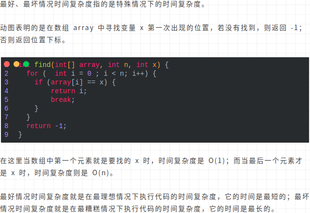

### 平均情况时间复杂度

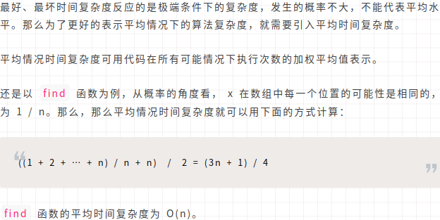

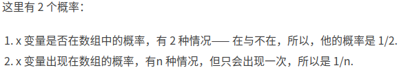

### 均摊复杂度分析

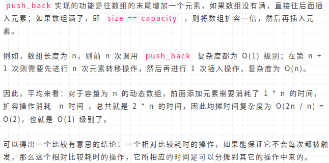

## 空间复杂度

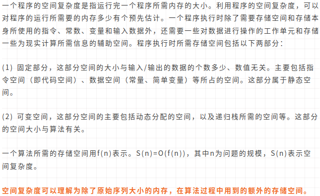

## 速查表

图例


抽象数据结构复杂度


排序算法


图操作


堆操作


参考链接:https://blog.csdn.net/lunahaijiao/article/details/107421596

# 算法

## 贪心算法

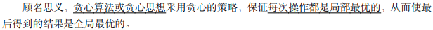

## 双指针

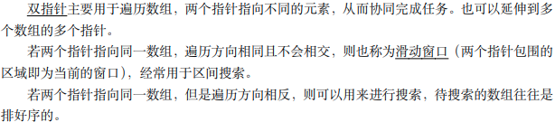

## 二分查找


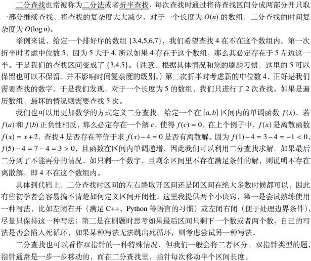

## 排序算法

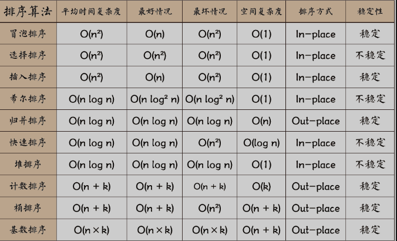

### 1.快速排序O(nlogn)

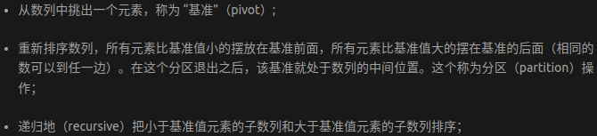


```c++
void quick_sort(vector<int> &nums,int l,int r)
{
    //数组长度需要大于1
    if(l+1>=r)
        return;
    int first=l,last=r-1,key=nums[first];
    while(first < last)
    {
        //右值大于key,则向左遍历，直到小于key
        while(first < last && nums[last] >= key)
            --last;
        nums[first]=nums[last];             //将该值给左值
        //左值小于key,则向右遍历，直到大于key
        while(first<last && nums[first] <= key)
            ++first;
        nums[last]=nums[first];             //将该值给右值

    }
    //最终first的左端端都小于key,first的右端都大于key,因此first为key
    nums[first]=key;
    //数组分成了大于nums[first]=key的右部分和小于它的左部分，因此继续在两边排序
    quick_sort(nums,l,first);
    quick_sort(nums,first+1,r);
}
```

### 2.归并排序O(nlogn)

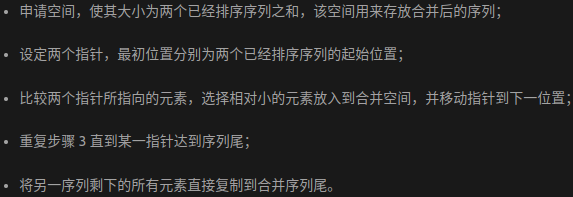


```c++
void merge_sort(vector<int> &nums,int l,int r,vector<int> &temp)
{
    //数组需要大于1
    if(l+1>=r)
        return;
    //分组 中间值
    int m=l+(r-l)/2;
    //左部分
    merge_sort(nums,l,m,temp);
    //右部分
    merge_sort(nums,m,r,temp);
    //合并
    //p和q分别指向左右两个数组的起始部分
    int p=l,q=m,i=l;
    //遍历两个数组 两个数组有一个未被遍历完都可以指向该循环
    while(p<m ||q < r)
    {
        //右部分遍历结束 或者 左部分指向数值小于等于右部分指向数值 则将左部分数值放入数组中
        if(q >= r || (p < m && nums[p] <= nums[q]))
            temp[i++]=nums[p++];
        else
        //否则，如左部分遍历结束 或者 左部分指向数值大于右部分指向数值 则将右部分数值放入数组中
            temp[i++]=nums[q++];
    }

    //将数组中已排序的部分更新
    for(i=l;i<r;++i)
    {
        nums[i] = temp[i];
    }
}
```

### 3.插入排序O(n^2)

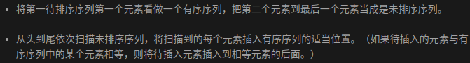


```c++
void insertion_sort(vector<int> &nums, int n)
{
    //遍历数组
    for(int i=0;i<n;++i)
    {
        //从i向数组起始位置遍历，如果当前值小于前面的值，则交换
        for(int j=i;j>0 && nums[j] < nums[j-1];--j)
        {
            swap(nums[j], nums[j - 1]);
        }
    }
}
```

### 4.冒泡排序O(n^2)

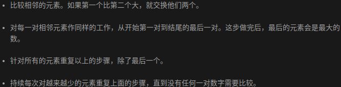


```c++
void bubble_sort(vector<int> &nums,int n)
{
    bool swapped;
    //数组中每一个值都会冒泡
    for(int i=1;i<n;++i)
    {
        //记录本次冒泡过程是否发生交换，首先将标志位置为false
        swapped=false;
        for(int j=1;j<n-i+1;++j)
        {
            //后一个数小于前一个数则交换
            if(nums[j]<nums[j-1])
            {
                swap(nums[j],nums[j-1]);
                swapped=true;
            }
        }
        //如果本次冒泡没有交换，则已排好序，不再冒泡
        if(!swapped)
        {
            break;
        }
    }
}
```

### 5.选择排序O(n^2)

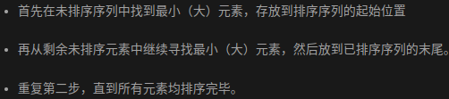


```c++
void selection_sort(vector<int> &nums,int n)
{
    int mid;
    //从数组起始到倒数第二个数，因为前面排好序后，最后一个数自然是最大的
    for(int i=0;i<n-1;++i)
    {
        mid =i;
        //在i之后的序列中找最小的数值，找到后更新索引mid
        for(int j=i+1;j<n;++j)
        {
            if(nums[j] < nums[mid])
            {
                mid = j;
            }
        }
        //将i的值与mid的值交换,即令i的值为从i到数组末尾的最小值
        swap(nums[mid],nums[i]);
        show_nums(nums);
    }
}
```

### 6.希尔排序O(nlogn)

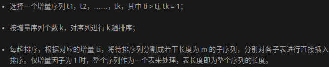


```c++
void shell_sort(vector<int> &q)
{
    int gap = q.size() / 2;
    while(gap)
    {
        for(int i=gap;i<q.size();i+=gap)
        {
            int t=q[i],j;
            //j搜索与i间隔为gap的前面所有值，将所有大于t的值放到t后面
            for(j=i-gap;j>=0;j-=gap)
            {
                if(q[j]>t)
                    q[j+gap]=q[j];
                else
                    break;
            }
            //找到t的位置
            q[j+gap] = t;
        }
        //缩小gap，进行下一轮排序
        gap/=2;
    }
}
```


### 7.堆排序O(nlogn)

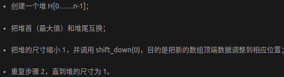


```c++
//将i节点为根的堆中小的数依次上移，n表示堆中的数据个数
void maxHeaplfy(vector<int> &A,int i,int n)
{
    int l=2*i+1;        //i的左儿子
    int r=2*i +2;       //i的右儿子
    int largest=i;      //先设置父节点和子节点三个节点中最大值的位置为父节点下标

    if(l<n && A[l]>A[largest])
        largest=l;
    if(r<n && A[r]>A[largest])
        largest=r;

    //最大值不是父节点，交换
    if(largest!=i)
    {
        swap(A[i],A[largest]);
        //递归调用，保证子树也是最大堆
        maxHeaplfy(A,largest,n);
    }
}

//最大堆
void buildMaxHeap(vector<int> &A,int n)
{
    //从最后一个非叶子节点(n/2-1)开始自底向上构建
    for(int i=n/2-1;i>=0;i--)           //从(n/2-1)调用一次maxHeaplfy就可以得到最大堆
        maxHeaplfy(A,i,n);
}

void HeapSort(vector<int>&h,int len)
{
    //建堆
    buildMaxHeap(h,len);
    //将数组从后往前遍历，依次与最大值互换位置即堆顶元素
    for(int i=len-1;i>=0;i--)
    {
        //最大值交换
        swap(h[i],h[0]);
        //调整从根节点到遍历节点位置之前的部分为最大堆
        maxHeaplfy(h,0,i);
    }
}
```


### 8.计数排序O(n+k)

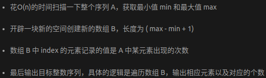


```c++
void countingSort(vector<int>& arr,int maxVal)
{
    int len=arr.size();
    if(len<1)
        return;
    vector<int> count(maxVal+1,0);
    vector<int> tmp(arr);
    for(auto x:arr)
        count[x]++;
    //计数小于等于当前数值的数量
    for(int i=1;i<=maxVal;++i)
       count[i]+=count[i-1];
    //从后向前遍历数组
    for(int i=len-1;i>=0;--i)
    {
        //由小于等于tmp[i]值的数量得到tmp[i]的位置
        arr[count[tmp[i]]-1]=tmp[i];
        //将小于等于tmp[i]的数量减一
        count[tmp[i]]--;                //注意这里减1
    }
}
```


### 9.桶排序O(n+k)

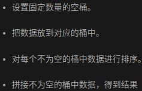


```c++
//单个桶的范围是10
const int BUCKET_NUM=10;

struct ListNode
{
    explicit ListNode(int i=0):mData(i),mNext(NULL){}
    ListNode *mNext;
    int mData;
};

ListNode* insert(ListNode* head,int val)
{
    ListNode dummyNode;
    ListNode *newNode = new ListNode(val);
    ListNode *pre,*curr;
    dummyNode.mNext=head;
    pre=&dummyNode;
    curr=head;
    //curr不为空且curr的值小于等于新结点的值时，向后移动
    while(NULL != curr && curr->mData<= val)
    {
        pre=curr;
        curr=curr->mNext;
    }
    //新结点插入到第一个比它大的值之前
    newNode->mNext=curr;
    pre->mNext=newNode;
    //返回head
    return dummyNode.mNext;
}

ListNode* Merge(ListNode *head1,ListNode *head2)
{
    ListNode dummyNode;
    ListNode *dummy=&dummyNode;
    //head1和head2都不为空时遍历，将较小的值加入到dummy后面
    while(NULL != head1 && NULL != head2)
    {
        if(head1->mData <= head2->mData)
        {
            dummy->mNext=head1;
            head1=head1->mNext;
        }
        else
        {
            dummy->mNext=head2;
            head2=head2->mNext;
        }
        dummy=dummy->mNext;
    }
    if(NULL != head1) dummy->mNext=head1;
    if(NULL != head2) dummy->mNext=head2;

    return dummyNode.mNext;
}

void BuckerSort(vector<int>& arr,int n)
{
    vector<ListNode*> buckets(BUCKET_NUM,(ListNode*)(0));
    for(int i=0;i<n;++i)
    {
        //根据数值大小获得桶序号
        int index = arr[i]/BUCKET_NUM;
        if(index>=BUCKET_NUM)
            index=BUCKET_NUM-1;
        //单个桶中插入数值并排序
        ListNode *head = buckets.at(index);
        buckets.at(index)=insert(head,arr[i]);
    }
    ListNode *head=buckets.at(0);
    //合并各个桶中排好的序列
    for(int i=1;i<BUCKET_NUM;++i)
    {
        head=Merge(head,buckets.at(i));
    }
    //将排好序列返回到数组中
    for(int i=0;i<n;++i)
    {
        arr[i]=head->mData;
        head=head->mNext;
    }
}
```


### 10.基数排序O(nxk)

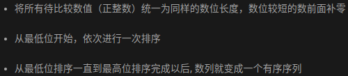


```c++
//辅助函数，求数据的最大位数
int maxbit(vector<int> data,int n)
{
    int maxData = data[0];      //最大数
    //先求出最大数，再求其位数，这样有原先依次每个数判断其位数
    for(int i=1;i<n;++i)
    {
        if(maxData < data[i])
            maxData=data[i];
    }
    int d=1;
    int p=10;
    //循环判断位数
    while(maxData >= p)
    {
        maxData /=10;
        ++d;
    }
    return d;
}

//基数排序
void radixsort(vector<int> data,int n)
{
    int d=maxbit(data,n);
    int *tmp=new int[n];
    int *count = new int[10];       //计数器
    int i,j,k;
    int radix=1;
    //进行d次排序
    for(i=1;i<=d;i++)
    {
        //每次分配前清空桶计数器
        for(j=0;j<10;j++)
            count[j]=0;
        //遍历数组
        for(j=0;j<n;j++)
        {
            k=(data[j]/radix) % 10; //统计每个桶中记录数
            count[k]++;
        }
        //将桶中数值更新为桶中及之前的数值之和
        for(j=1;j<10;j++)
            count[j] = count[j-1] + count[j];
        //将所有桶中记录依次收集到tmp中
        for(j=n-1;j>=0;j--)
        {
            k=(data[j]/radix) % 10;
            tmp[count[k]-1]=data[j];
            count[k]--;
        }
        //将临时数组的内容复制到data中
        for(j=0;j<n;j++)
            data[j]=tmp[j];
        radix=radix*10;
    }
    delete []tmp;
    delete []count;
}
```

## 搜索

深度优先搜索和广度优先搜索是两种最常见的优先搜索方法，它们被广泛地运用在图和树等 结构中进行搜索。

### 深度优先搜索

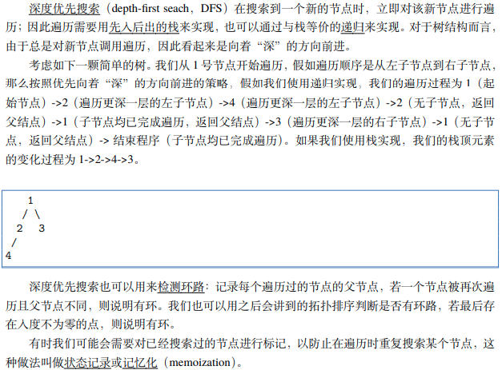

### 回溯法

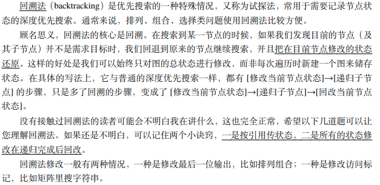

### 广度优先搜索

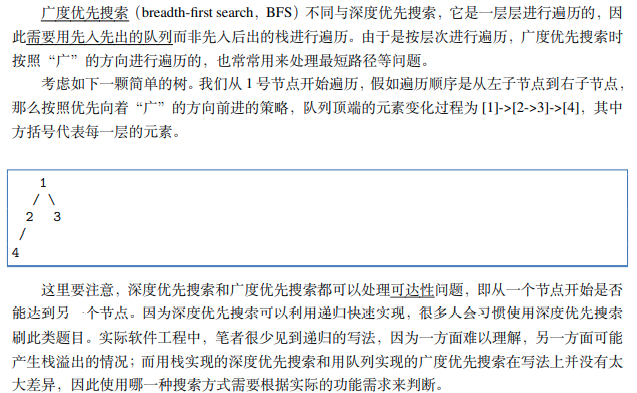

## 动态规划

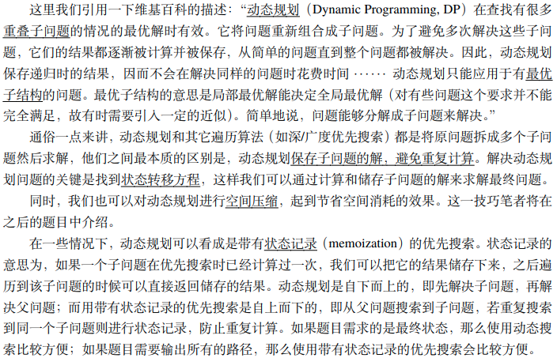

## 分治法

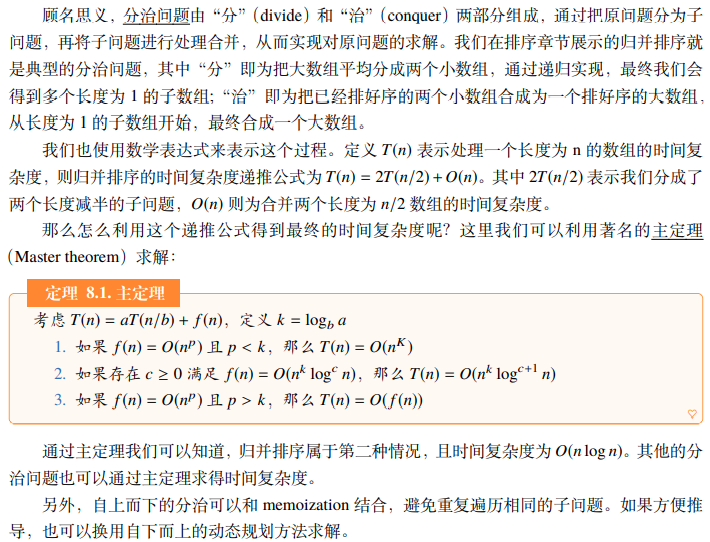


# 数据结构

## C++ STL

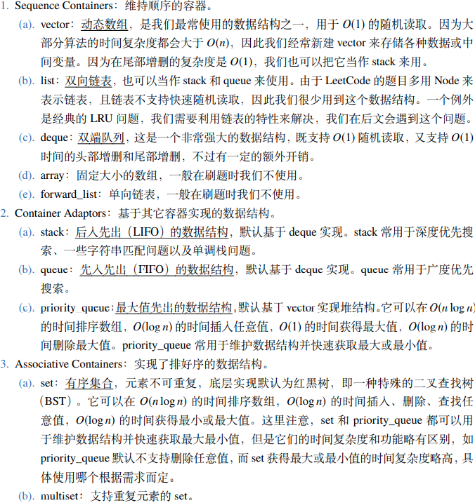

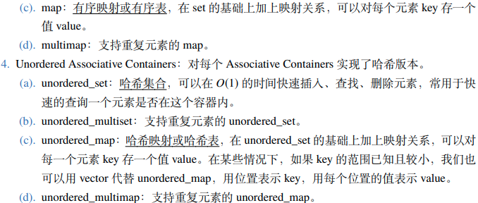

## 单调栈

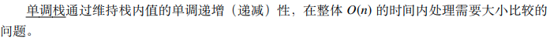

## 优先队列

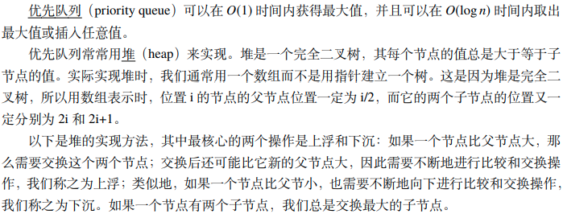

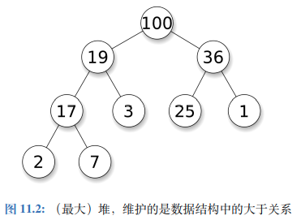

## 哈希表

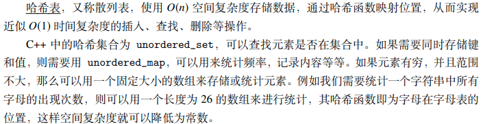

## 前缀和与积分图


## 链表


## 树


## 前中后序遍历


## 二叉查找树


## 字典树


## 图


## 二分图


## 拓扑排序


## 并查集


# 数学

## 公倍数与公因数


## 质数


## 位运算


